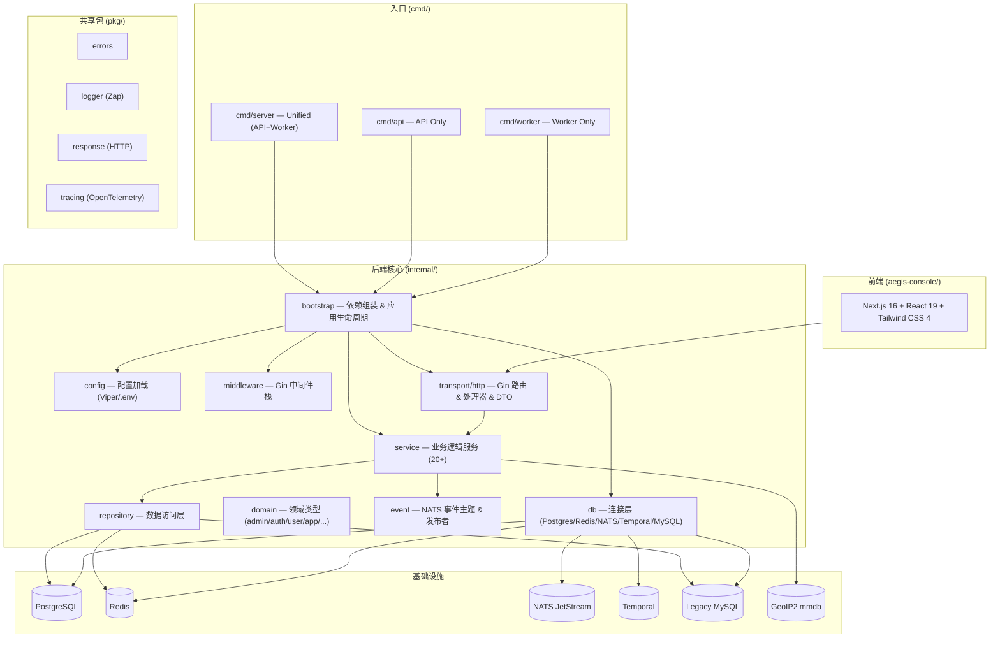

# Aegis — AI 上下文索引

> 更新时间：2026-03-21 | 项目语言：Go 1.26 + TypeScript

## 项目概览

**Aegis** 是一套生产级多租户用户系统平台，提供：
- 完整的用户认证 / 授权 / OAuth2 / 多因子 / 会话管理
- 多应用（App）隔离，每个 App 独立用户库
- 积分、签到、等级、通知、工作流、存储等增值能力
- 管理后台 API + 管理前端（aegis-console）

## 架构总览



## 模块索引

| 路径 | 说明 | 详细文档 |
|---|---|---|
| `cmd/` | 三个可执行入口 | — |
| `internal/bootstrap/` | 应用启动 & CLI 命令 | [AGENTS.md](internal/bootstrap/AGENTS.md) |
| `internal/config/` | 配置结构 & 加载 | [AGENTS.md](internal/config/AGENTS.md) |
| `internal/db/` | 数据库/中间件连接 | — |
| `internal/domain/` | 所有领域类型定义 | [AGENTS.md](internal/domain/AGENTS.md) |
| `internal/event/` | NATS 事件主题常量 | — |
| `internal/middleware/` | Gin 中间件（防火墙/认证/加密/限流） | [AGENTS.md](internal/middleware/AGENTS.md) |
| `internal/repository/` | Postgres / Redis / LegacyMySQL 数据访问 | [AGENTS.md](internal/repository/AGENTS.md) |
| `internal/service/` | 所有业务逻辑服务 | [AGENTS.md](internal/service/AGENTS.md) |
| `internal/transport/http/` | Gin 路由、Handler、DTO、OpenAPI | [AGENTS.md](internal/transport/http/AGENTS.md) |
| `pkg/` | 共享工具包（errors/logger/response/tracing） | — |
| `migrations/postgres/` | 17 个顺序 SQL 迁移文件 | — |
| `aegis-console/` | Next.js 管理前端 | [AGENTS.md](aegis-console/AGENTS.md) |

## 开发命令

### 后端

```bash
# 启动（Unified 模式：API + Worker，推荐）
go run ./cmd/server

# 仅 API 服务
go run ./cmd/api

# 仅 Worker
go run ./cmd/worker

# 数据库迁移（顺序执行 migrations/postgres/*.up.sql）
go run ./cmd/server migrate

# 导出 OpenAPI 规范
go run ./cmd/server openapi docs/openapi.json

# 导出 Postman 集合
go run ./cmd/server postman

# 遗留用户迁移（需配置 LEGACY_MYSQL_DSN）
go run ./cmd/server sync-legacy-user <user_id>
go run ./cmd/server sync-legacy-batch [lastID] [limit]

# 运行测试
go test ./...
```

### 前端（aegis-console）

```bash
cd aegis-console
pnpm dev        # 开发服务器
pnpm build      # 生产构建
pnpm typecheck  # 类型检查
pnpm lint       # ESLint
```

## 必填环境变量

| 变量 | 说明 |
|---|---|
| `JWT_SECRET` | JWT 签名密钥 |
| `POSTGRES_DSN` | PostgreSQL 连接串 |
| `REDIS_ADDR` | Redis 地址 |
| `NATS_URL` | NATS 连接地址 |
| `ADMIN_API_TOKEN` | 管理员 API 静态令牌 |
| `ADMIN_BOOTSTRAP_*` | 超级管理员初始账号信息 |

详见 `.env.example`，默认端口 `8088`。

## 全局规范

- **错误响应**：统一使用 `pkg/response` 的 `response.Error()` / `response.OK()`，禁止裸 `c.JSON`
- **日志**：`go.uber.org/zap` 结构化日志，生产代码禁用 `fmt.Println`
- **分层严格性**：handler → service → repository，handler 禁止直接调用 repository
- **配置注入**：所有配置通过 `internal/config.Config` 传入，禁止业务代码调用 `os.Getenv`
- **数据库事务**：复杂写操作必须使用 pgx 显式事务
- **代码注释**：使用中文（与现有代码库保持一致）

## 技术栈

| 层 | 技术 |
|---|---|
| HTTP 框架 | Gin v1.12 |
| 主数据库 | PostgreSQL (pgx/v5 连接池) |
| 缓存/会话 | Redis v9 |
| 消息队列 | NATS JetStream |
| 工作流引擎 | Temporal |
| WAF | Coraza v3 + OWASP CRS v4 |
| 权限控制 | Casbin v2 (RBAC) |
| 多云存储 | Azure Blob / Aliyun OSS / AWS S3 / Tencent COS / Qiniu / WebDAV |
| OAuth2 | QQ / 微信 / GitHub / Google / Microsoft / 微博 |
| 地理位置 | GeoIP2 MaxMind mmdb (自动更新) |
| 可观测性 | OpenTelemetry + Zap |
| 前端 | Next.js 16 + React 19 + Tailwind CSS 4 + shadcn/ui |
