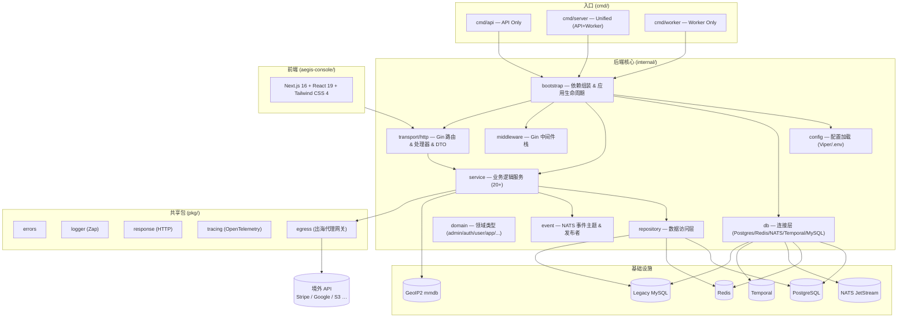

# Aegis — AI 上下文索引

> 更新时间：2026-03-21 | 项目语言：Go 1.26 + TypeScript

## 项目概览

**Aegis** 是一套生产级多租户用户系统平台，提供：
- 完整的用户认证 / 授权 / OAuth2 / 多因子 / 会话管理
- 多应用（App）隔离，每个 App 独立用户库
- 积分、签到、等级、通知、工作流、存储等增值能力
- 管理后台 API + 管理前端（aegis-console）

## 架构总览



## 模块索引

| 路径 | 说明 | 详细文档 |
|---|---|---|
| `cmd/` | 三个可执行入口 | — |
| `internal/bootstrap/` | 应用启动 & CLI 命令 | [CLAUDE.md](internal/bootstrap/CLAUDE.md) |
| `internal/config/` | 配置结构 & 加载 | [CLAUDE.md](internal/config/CLAUDE.md) |
| `internal/db/` | 数据库/中间件连接 | — |
| `internal/domain/` | 所有领域类型定义 | [CLAUDE.md](internal/domain/CLAUDE.md) |
| `internal/domain/organization/` | **组织架构**：租户边界、UUID 对外标识、内置角色与权限目录 | [docs](docs/organization.md) |
| `internal/event/` | NATS 事件主题常量 | — |
| `internal/middleware/` | Gin 中间件（防火墙/认证/加密/限流） | [CLAUDE.md](internal/middleware/CLAUDE.md) |
| `internal/repository/` | Postgres / Redis / LegacyMySQL 数据访问 | [CLAUDE.md](internal/repository/CLAUDE.md) |
| `internal/service/` | 所有业务逻辑服务 | [CLAUDE.md](internal/service/CLAUDE.md) |
| `internal/transport/http/` | Gin 路由、Handler、DTO、OpenAPI | [CLAUDE.md](internal/transport/http/CLAUDE.md) |
| **平台治理** | 全站应用的冻结 / 封禁 / 限制 / 申诉（超管与平台管理员） | [docs](docs/platform-governance.md) |
| `pkg/egress/` | **出海代理网关**：域名后缀路由 + 多协议端点 + 健康检查 | [docs](docs/egress-gateway.md) |
| `pkg/banner/` | **启动横幅渲染引擎**：FIGlet 艺术字 + 明细表格 + 终端能力降级 | [bootstrap](internal/bootstrap/CLAUDE.md#启动横幅) |
| `pkg/receipt/` | **支付凭证 PDF**：10 语言 A4 排版 + 字体决策 + 分页 | [docs](docs/payment-receipt.md) |
| `pkg/i18n/` | **通用国际化**：语言协商 + CLDR 复数 + 定点金额/日期格式化 | [docs](docs/payment-receipt.md#语言协商) |
| `pkg/fontkit/` | **字体归一化**：TTC 拆分成独立 sfnt + 字符覆盖度查询 | [docs](docs/payment-receipt.md#中日韩字体) |
| `pkg/` | 共享工具包（errors/logger/response/tracing） | — |
| `migrations/postgres/` | 顺序 SQL 迁移文件（000001–000068） | — |
| `sdk/kotlin/` | **官方 Kotlin/Java 客户端**：三档 transport 适配器 + 全量 API，Android 与 JVM 服务端共用 | [README](sdk/kotlin/README.md) |
| `aegis-console/` | Next.js 管理前端 | [CLAUDE.md](aegis-console/CLAUDE.md) |

## 开发命令

### 后端

```bash
# 启动（Unified 模式：API + Worker，推荐）
go run ./cmd/server

# 仅 API 服务
go run ./cmd/api

# 仅 Worker
go run ./cmd/worker

# 数据库迁移（顺序执行 migrations/postgres/*.up.sql）
go run ./cmd/server migrate

# 导出 OpenAPI 规范
go run ./cmd/server openapi docs/openapi.json

# 导出 Postman 集合
go run ./cmd/server postman

# 遗留用户迁移（需配置 LEGACY_MYSQL_DSN）
go run ./cmd/server sync-legacy-user <user_id>
go run ./cmd/server sync-legacy-batch [lastID] [limit]

# 旧 Node.js 系统 mysqldump 文件直导（无需 MySQL 实例；统一密码 + 指定应用，详见 docs/import-nodejs-dump.md）
go run ./cmd/server import-dump <dump.sql> --appid <id> --password <统一密码> [--dry-run]

# 运行测试
go test ./...
```

### 前端（aegis-console）

```bash
cd aegis-console
pnpm dev        # 开发服务器
pnpm build      # 生产构建
pnpm typecheck  # 类型检查
pnpm lint       # ESLint
```

## 必填环境变量

| 变量 | 说明 |
|---|---|
| `JWT_SECRET` | JWT 签名密钥 |
| `POSTGRES_DSN` | PostgreSQL 连接串 |
| `REDIS_ADDR` | Redis 地址 |
| `NATS_URL` | NATS 连接地址 |
| `ADMIN_API_TOKEN` | 管理员 API 静态令牌 |
| `ADMIN_BOOTSTRAP_*` | 超级管理员初始账号信息 |

详见 `.env.example`，默认端口 `8088`。

可选：`EGRESS_*` —— 出海代理网关。配好端点与域名后缀规则后，平台内所有出网调用
（OAuth / 支付 / 对象存储 / GeoIP / Webhook / 邮件）按同一张路由表决定走直连还是境外线路。
关闭时全部直连，详见 [docs/egress-gateway.md](docs/egress-gateway.md)。

可选：`DOCS_PORTAL_URL`（默认 `/developers`）—— 后端 `/docs` 的 302 目标。
文档由 aegis-console 的公开门户承载，后端只保留 `/openapi.json`；前后端分域部署时填绝对地址。

## 全局规范

- **错误响应**：统一使用 `pkg/response` 的 `response.Error()` / `response.OK()`，禁止裸 `c.JSON`
- **日志**：`go.uber.org/zap` 结构化日志，生产代码禁用 `fmt.Println`
- **分层严格性**：handler → service → repository，handler 禁止直接调用 repository
- **配置注入**：所有配置通过 `internal/config.Config` 传入，禁止业务代码调用 `os.Getenv`
- **数据库事务**：复杂写操作必须使用 pgx 显式事务
- **代码注释**：使用中文（与现有代码库保持一致）
- **配置项必须有执行点**：任何可配置的开关/阈值，落库的同时必须有代码真正读它。
  只存不读的配置比没有这个配置更危险 —— 管理员会以为已经防住了。
  同一件事也不允许有两处配置入口（接入方无从判断哪个生效）。

## 平台治理（谁说了算）

除了「应用级 / 平台级」这条**配置**的作用域线，还有一条**权力**的线：
应用自治的开关，和平台强制的结论。

| | 应用自治 | 平台治理 |
|---|---|---|
| 载体 | `apps.status` / `login_status` / `register_status` | `app_governance_states` 表 |
| 谁能改 | 该应用管理员（`app:write`） | 平台级管理员（全局作用域 `platform:app:govern`） |
| 入口 | 控制台 `/apps/{appKey}` | 控制台 `/platform` |

两者是**与**的关系，且治理先判 —— 被冻结的应用把自己的 `status` 打开也没用。
之所以分表存放，正是为了让应用管理员改不动平台的结论。

六档状态 `active / restricted / frozen / suspended / banned / archived`，
七项限制（登录 / 注册 / 接口 / 支付 / 存储 / 通知 / 管理端写）**每一项都有明确执行点**，
索引见 [docs/platform-governance.md](docs/platform-governance.md#七项限制与它们的执行点)。

`/api/admin/platform/*` 全前缀恒按**全局作用域**鉴权：一旦变成应用级，
被冻结应用自己的管理员就能给自己解封。这条有测试钉住。

## 配置的两种作用域

| 作用域 | 存储 | 管理入口 | 判据 |
|---|---|---|---|
| 应用级 | `apps.settings` JSONB（`policy` / `passwordPolicy` / `captcha` / `transportEncryption` / `integralPerCurrency`） | 控制台 `/apps/{appKey}`，路径里的 appKey 即作用域 | 换个应用这项会不同 |
| 平台级 | `platform_settings` K/V（firewall / security / adminCaptcha / ldap / oidc / saml / branding） | 控制台 `/configuration`（超管，无应用选择器） | 对所有应用一视同仁 |

新增配置项先确定归属，**不要两边都放**。应用级策略的逐项执行点索引见
[internal/service/CLAUDE.md](internal/service/CLAUDE.md#应用级认证策略的执行点)。

## 应用接入协议（App Protocol v1）

接入方只需要认识一个命名空间：`/api/v1/apps/{appKey}/*`，覆盖登录之后客户端
真正要用的**全部**能力：认证生命周期、资料与设置、二次认证与 Passkey、会话与审计、
签到 / 积分 / 排行榜、站内信、钱包 / 会员 / 支付、存储上传、工单、轮播图 / 公告 / 版本检查。

接口目录是**单一事实源**（`internal/service/auth_protocol_catalog.go`），随 `/config`
以机器可读形式下发（`operations` 带方法与鉴权要求，`errors` 带错误码与恢复动作）。
目录与真实路由由 `TestGatewayCatalogMatchesRegisteredRoutes` 双向钉死：
目录多一条 → 生成式客户端会调出 404；路由多一条 → 那个能力对生成式客户端不存在。

官方客户端：[sdk/kotlin](sdk/kotlin) —— Kotlin/JVM 纯实现，Android 与 Java 服务端共用一份产物。

认证方式由 `loginMethods` / `registerMethods` 控制，两者可选集合刻意不同：

| 方式 | 登录 | 注册 | 入口 |
|---|:--:|:--:|---|
| `password` | ✅ | ✅ | `/auth/login`、`/auth/register`（`method` 字段分流） |
| `sms` | ✅ | ✅ | 先 `/auth/sms/code` 取码，再走同两个入口 |
| `oauth` | ✅ | — | `/auth/oauth/url` + `callback`，或原生 `exchange` |

**第三方没有应用级注册开关** —— 能否自动建号由每个渠道自己的 `allowRegister` 决定。
在这里再加一个开关会变成两处配同一件事，接入方无从判断哪个生效。
启用 `sms` 时 `identifiers` 必须含 `phone`（`40086`）。

`/config` 与 `/auth/oauth/callback` 是仅有的两条**免包装**路径：前者是
"要读配置得先按配置包装"的死锁出口，后者由第三方重定向浏览器发起、
客户端根本没机会包装它（因此 sealed 档下回跳也是明文的，需要全链路加密请走 `exchange`）。

三档安全等级 **standard / signed / sealed** 共用同一批路径与同一份 JSON 结构，
只改变请求"怎么包装"——升档只替换一层 transport 适配器，业务代码不动：

| 等级 | 客户端要做的事 |
|---|---|
| `standard`（默认） | HTTPS + JSON。无密钥、无握手、无密码学库 |
| `signed` | 额外算一个 HMAC-SHA256 请求签名（v2，**覆盖 query string**） |
| `sealed` | 在 signed 之上再叠 Transport v2 端到端加密载荷 |

等级累加：`sealed = signed + 加密`。AEAD 只证明密文没被改过（服务端公钥公开，
谁都能造合法密文），签名才证明调用方持有 `appSecret`，两者缺一不可。

三条覆盖全部 HTTP 形状的规则（缺一条就有一类接口进不了这个命名空间）：

| 形状 | 怎么包装 |
|---|---|
| 有请求体（POST/PUT） | 密文走 body |
| 无请求体（GET/DELETE/HEAD） | 密文走 `?_payload=`，明文是真正的 query string |
| 上传（multipart） | 整个 multipart 体加密，原始类型由 `X-Aegis-Plain-Content-Type` 声明 |

**GET 不能带 body** —— HTTP 允许，但 OkHttp / URLSession / fetch 全都拒绝构造，
恰好就是 Android / iOS / Web 三端。因此无请求体的方法只能走 query。

签名 v2 比 v1 多一行原样 query。v1 只在请求没有 query 时才被接受（否则 `40176`）：
不签 query 意味着 `?page=1` 能被改成 `?page=999` 而签名照过。

**包装规格有四处真实来源，改协议必须同步**，否则控制台的「接入自检」会立刻红掉：

| 位置 | 角色 |
|---|---|
| `internal/service/auth_protocol_service.go` | 服务端校验 |
| `internal/service/auth_protocol_selftest.go` | 参考客户端实现（自检实跑，body 与 query 两条链路各跑一次） |
| `aegis-console/src/lib/integration-snippets.ts` | 给接入方抄的示例（门户与控制台共用） |
| `sdk/kotlin/.../AegisCanonical.kt` | 官方 SDK 里唯一允许拼协议字符串的地方 |

前两处与最后一处另有**逐字节互锚**的测试：`auth_protocol_canonical_test.go`
与 Kotlin 的 `AegisCanonicalTest` 断言同一批字面量。签名对不上时错误只会说「不对」，
不会说「哪一行不对」，所以这串字节必须有测试直接盯着。

完整规格见 [docs/app-integration.md](docs/app-integration.md)。
旧 `/api/auth/*` 明文命名空间由每个应用的 `allowLegacy` 开关控制，与安全等级正交。

## 技术栈

| 层 | 技术 |
|---|---|
| HTTP 框架 | Gin v1.12 |
| 主数据库 | PostgreSQL + PostGIS（pgx/v5 连接池；地理风控/分析依赖 PostGIS，镜像见 deploy/docker/postgres/Dockerfile） |
| 缓存/会话 | Redis v9 |
| 消息队列 | NATS JetStream |
| 工作流引擎 | Temporal |
| WAF | Coraza v3 + OWASP CRS v4 |
| 权限控制 | Casbin v2 (RBAC) |
| 密码强度 | zxcvbn（trustelem 端口，猜测次数估算）+ PRECIS RFC 8265 OpaqueString（x/text，归一化与合法性）+ 自带中文语境弱口令补充表，详见 [internal/service](internal/service/CLAUDE.md#密码强度评估--zxcvbn不是字符类规则) |
| 多云存储 | Azure Blob / Aliyun OSS / AWS S3 / Tencent COS / Qiniu / WebDAV |
| OAuth2 | QQ / 微信 / GitHub / Google / Microsoft / 微博 |
| 支付渠道 | 16 个内置渠道，均由 `Provider.Describe()` 自描述（详见 [internal/service/CLAUDE.md](internal/service/CLAUDE.md#支付网关)）：<br>内部钱包 / 支付宝 (smartwalle) / 微信支付 (官方 wechatpay-go) / 易支付系聚合（易支付·彩虹·虎皮椒·PAYJS·码支付·V免签）/ Stripe (stripe-go) / PayPal (plutov) / Paddle / Lemon Squeezy / Square / Razorpay / Coinbase Commerce |
| 邮件出口 | 可插拔 provider：`smtp` 直连（go-mail）/ `zeabur` REST API（详见 [docs/zeabur-email.md](docs/zeabur-email.md)）<br>**Zeabur 平台封禁出站 SMTP 端口**，部署在其上时只能走 `zeabur` 档 |
| 出海代理 | 自研网关（`pkg/egress`）：域名后缀路由 + http/https/socks5/socks5h/ssh/trojan/shadowsocks，协议实现分别来自 x/net/proxy、x/crypto/ssh、go-shadowsocks2 |
| 启动横幅 | `pkg/banner`：go-figure（FIGlet 艺术字，内嵌 148 字体）+ go-pretty（表格/着色，自带 NO_COLOR 与 Windows VT 识别）+ gopsutil（主机事实）+ go-humanize + go-isatty/x/term（终端探测） |
| 支付凭证 | `pkg/receipt`：gopdf（PDF 引擎，支持 TTF 子集嵌入）+ `pkg/fontkit`（TTC → 独立 sfnt，gopdf 读不了 TTC/OTF）+ `pkg/i18n`（x/text 的语言协商与 CLDR 复数）+ x/image/gofont（内嵌拉丁字形，保证英文凭证零依赖）+ go-colorful（Lab 空间配色派生与 WCAG 对比度）+ boombuler/barcode（矢量二维码）。10 语言、默认 en、Claude 暖调配色，详见 [docs](docs/payment-receipt.md) |
| 地理位置 | GeoIP2 MaxMind mmdb (自动更新) |
| 风控引擎 | expr-lang/expr（表达式规则，**类型化 Env + 编译缓存**，写错变量名在保存时即报错）+ mileusna/useragent（客户端解析：设备型号 / 桌面·移动·平板·Bot 分类 / 浏览器与系统版本）+ redis_rate GCRA 限流 + Redis HyperLogLog 基数统计（账号扩散速度），详见 [internal/service](internal/service/CLAUDE.md#riskservice--风控中心) |
| 可观测性 | OpenTelemetry + Zap |
| 前端 | Next.js 16 + React 19 + Tailwind CSS 4 + shadcn/ui |
