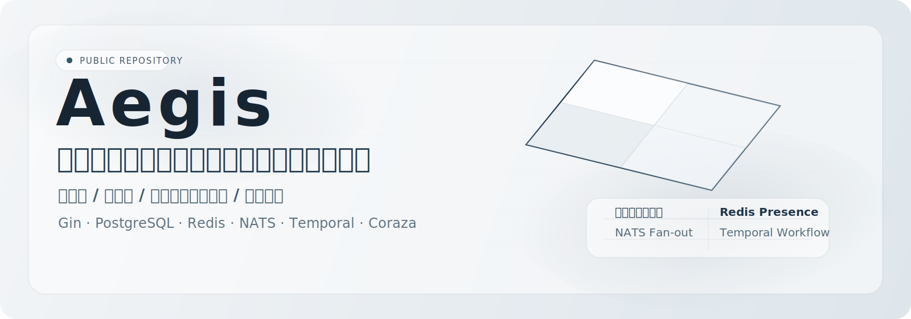
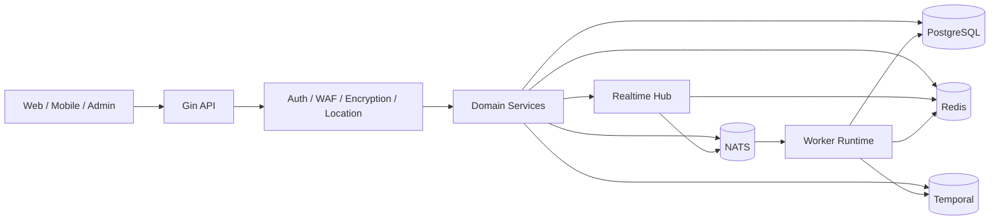

<div align="center">
  
</div>

<div align="center">

**言語:** [English](README.md) | [简体中文](README.zh-CN.md) | **日本語**

[](https://go.dev/)
[](https://gin-gonic.com/)
[](https://www.postgresql.org/)
[](https://redis.io/)
[](https://nats.io/)
[](https://temporal.io/)
[](https://coraza.io/)
[](LICENSE)
[](https://github.com/MiChongs/aegis/actions/workflows/go-ci.yml)

**Aegis** は、高並列、強いテナント分離、低結合なサービス設計、リアルタイム対応を重視した、本番運用向けのマルチテナントユーザープラットフォームです。

<p>
  <a href="#プラットフォーム概要">プラットフォーム概要</a> ·
  <a href="#アーキテクチャ">アーキテクチャ</a> ·
  <a href="#技術スタック">技術スタック</a> ·
  <a href="#機能マップ">機能マップ</a> ·
  <a href="#api-リファレンス">API リファレンス</a> ·
  <a href="#デプロイ方式">デプロイ</a> ·
  <a href="#開発フロー">開発</a>
</p>

</div>

## プラットフォーム概要

<table>
  <tr>
    <td width="33%">
      <strong>実行モデル</strong><br/>
      単一の Go ランタイムで <code>api + worker</code> を統合し、明確なブートストラップ境界を持ちます。
    </td>
    <td width="33%">
      <strong>テナント分離</strong><br/>
      <code>appid</code> を軸に、セッション、キャッシュ、通知、リアルタイム経路をアプリ単位で分離します。
    </td>
    <td width="33%">
      <strong>運用志向</strong><br/>
      ホットパスの安定性、キャッシュ優先検証、非同期処理、公開向け安全応答を重視しています。
    </td>
  </tr>
  <tr>
    <td width="33%">
      <strong>主要ストレージ</strong><br/>
      PostgreSQL がトランザクションデータを、Redis がセッション、キャッシュ、未読数、Presence を担当します。
    </td>
    <td width="33%">
      <strong>非同期基盤</strong><br/>
      NATS がイベント分配を、Temporal がワークフロー制御を担当します。
    </td>
    <td width="33%">
      <strong>リアルタイム層</strong><br/>
      Gorilla WebSocket、Redis Presence、NATS 配信を組み合わせた独立サブシステムです。
    </td>
  </tr>
</table>

## エンジニアリングスナップショット

| 項目 | 内容 |
| --- | --- |
| 位置付け | ユーザーシステムおよびアプリ向けサービスのためのマルチテナントバックエンド基盤 |
| ランタイム | Gin API + Worker を統合した Go エントリーポイント |
| 分離方式 | `appid` 単位のサービス、キャッシュ、通知、Presence 境界 |
| 永続化 | PostgreSQL |
| キャッシュと Presence | Redis |
| メッセージング | NATS |
| ワークフロー | Temporal |
| 境界防御 | Coraza WAF、通信暗号化、サニタイズ済みレスポンス |

## アーキテクチャ



### リクエスト処理方針

<table>
  <tr>
    <td width="25%"><strong>認証</strong><br/>JWT 解析 + Redis セッション検証</td>
    <td width="25%"><strong>公開コンテンツ</strong><br/>PostgreSQL + Redis キャッシュ</td>
    <td width="25%"><strong>ユーザー表示</strong><br/>キャッシュ認識型集約</td>
    <td width="25%"><strong>リアルタイム配信</strong><br/>ローカル Hub + NATS Fan-out</td>
  </tr>
  <tr>
    <td width="25%"><strong>Presence</strong><br/>Redis TTL インデックス</td>
    <td width="25%"><strong>バックグラウンド処理</strong><br/>NATS → Worker</td>
    <td width="25%"><strong>ワークフロー</strong><br/>Temporal 実行</td>
    <td width="25%"><strong>公開エラー応答</strong><br/>サニタイズ済みの安全なレスポンス</td>
  </tr>
</table>

## 技術スタック

| レイヤ | 技術 |
| --- | --- |
| 言語 | Go 1.26 |
| HTTP | Gin |
| データベース | PostgreSQL |
| キャッシュ / セッション / Presence | Redis |
| メッセージング | NATS |
| ワークフロー | Temporal |
| リアルタイム通信 | Gorilla WebSocket |
| セキュリティ | JWT、Coraza WAF、通信暗号化 |
| ロギング | Zap |
| デプロイ | Docker Compose、Windows スクリプト |

## 機能マップ

<table>
  <tr>
    <td width="33%">
      <strong>認証とアクセス制御</strong><br/><br/>
      パスワード認証<br/>
      OAuth2 Provider 連携<br/>
      JWT 発行と検証<br/>
      セッション索引と失効処理<br/>
      階層型管理者モデル
    </td>
    <td width="33%">
      <strong>ユーザープラットフォーム</strong><br/><br/>
      プロフィールと設定管理<br/>
      サインイン状態と履歴<br/>
      通知センター<br/>
      セッション監査<br/>
      ポイントとランキング
    </td>
    <td width="33%">
      <strong>リアルタイムとランタイム</strong><br/><br/>
      グローバル WebSocket 入口<br/>
      Presence 索引<br/>
      NATS クロスインスタンス配信<br/>
      Worker イベント処理<br/>
      Temporal ワークフロー実行
    </td>
  </tr>
</table>

## リアルタイムモデル

リアルタイム層は、業務サービスに密結合させず、独立したサブシステムとして設計されています。

| 関心事 | 実装 |
| --- | --- |
| 接続ライフサイクル | プロセス内 Hub |
| Presence 保存 | Redis TTL インデックス |
| ノード間配信 | NATS Subject |
| テナント範囲 | `appid + userId` |
| 業務連携 | インターフェースベース Publisher |

### リアルタイム関連エンドポイント

```text
GET /api/ws
GET /api/admin/system/online/stats
GET /api/admin/system/online/apps/:appid
GET /api/admin/system/online/apps/:appid/users
```

## API リファレンス

本プロジェクトには、自動生成される OpenAPI ドキュメントと、モダンな内蔵リファレンス UI が組み込まれています。

| 成果物 | パス |
| --- | --- |
| API リファレンス | `GET /docs` |
| OpenAPI JSON | `GET /openapi.json` |
| 静的エクスポート | `go run ./cmd/server openapi ./docs/openapi.json` |

### 採用方針

- `kin-openapi` によるコード駆動の OpenAPI 生成を採用し、Swagger 注釈方式には依存しません。
- 外部 CDN に依存しない内蔵ドキュメントページにより、デプロイ環境でも安定して参照できます。
- ドキュメント層をサービス実装から分離し、API の進化時にも低結合を維持します。

## デプロイ方式

<table>
  <tr>
    <td width="50%">
      <strong>ローカル開発</strong><br/><br/>
      <code>cp .env.example .env</code><br/>
      <code>docker compose -f deploy/docker/docker-compose.yml up -d</code><br/>
      <code>go run ./cmd/server migrate</code><br/>
      <code>go run ./cmd/server</code>
    </td>
    <td width="50%">
      <strong>Windows ワンクリック</strong><br/><br/>
      <code>.\deploy\windows\one-click-deploy.cmd</code><br/><br/>
      補助コマンド:<br/>
      <code>start-stack.cmd</code><br/>
      <code>stop-stack.cmd</code><br/>
      <code>status.cmd</code>
    </td>
  </tr>
</table>

## プロジェクト構成

```text
cmd/
  api/                API entry
  server/             unified runtime entry
  worker/             worker entry
internal/
  bootstrap/          application assembly
  config/             configuration loading
  db/                 postgres / redis / nats / temporal clients
  domain/             domain contracts and types
  event/              subjects and publisher
  middleware/         auth, waf, encryption, location
  repository/         postgres, redis, legacy adapters
  service/            business orchestration
  transport/http/     gin handlers and router
deploy/
  docker/             docker runtime assets
  windows/            deployment scripts
migrations/postgres/  schema migrations
pkg/
  errors/             typed application errors
  logger/             logger bootstrap
  response/           response envelope
  tracing/            tracing integration
```

<details>
  <summary><strong>詳細な API 一覧</strong></summary>

### 認証

```text
POST /api/auth/register/password
POST /api/auth/login/password
POST /api/auth/oauth2/auth-url
GET  /api/auth/oauth2/callback
POST /api/auth/oauth2/mobile-login
POST /api/auth/refresh
POST /api/auth/logout
POST /api/auth/password/verify
POST /api/auth/password/change
```

### ユーザー

```text
GET    /api/user/banner
GET    /api/user/notice
POST   /api/user/my
GET    /api/user/profile
PUT    /api/user/profile
GET    /api/user/settings
PUT    /api/user/settings
GET    /api/user/security
GET    /api/user/sessions
DELETE /api/user/sessions/:tokenHash
POST   /api/user/sessions/revoke-all
GET    /api/user/signin/status
GET    /api/user/signin/history
POST   /api/user/signin
```

### 通知

```text
GET    /api/notifications
GET    /api/notifications/unread-count
POST   /api/notifications/read
POST   /api/notifications/read-batch
POST   /api/notifications/read-all
DELETE /api/notifications/:notificationId
POST   /api/notifications/clear
```

</details>

## 開発フロー

### ローカル検証

```bash
go mod tidy
go test ./...
```

### CI

GitHub Actions では以下を実行します。

- 依存解決
- `go test ./...`

ワークフローファイル:

- [`.github/workflows/go-ci.yml`](.github/workflows/go-ci.yml)

## セキュリティノート

- `.env` や本番用シークレットをコミットしないでください。
- 機密設定は環境変数またはシークレットストアで管理してください。
- 公開レスポンスに内部実装の詳細を含めないでください。

## ライセンス

本プロジェクトは独自の専有ライセンスの下で提供されます。
書面による事前許可なく、商用利用および再配布は禁止されています。
全文は [LICENSE](LICENSE) を参照してください。
