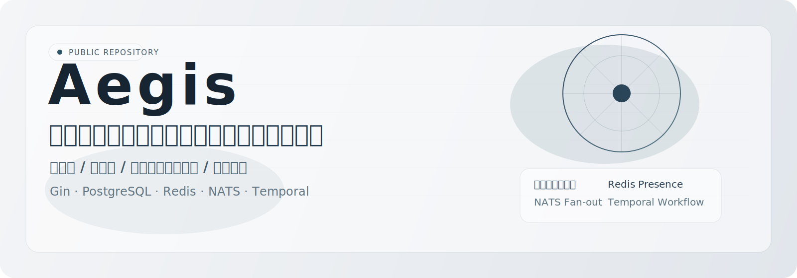
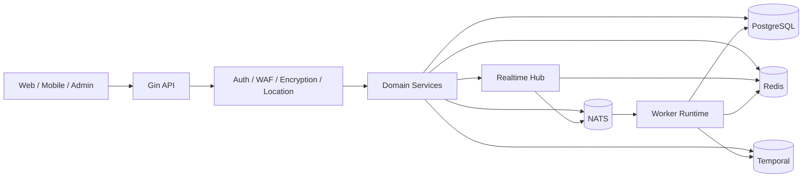

<div align="center">
  
</div>

<div align="center">

**言語:** [English](README.md) | [简体中文](README.zh-CN.md) | **日本語**

[](https://go.dev/)
[](https://gin-gonic.com/)
[](https://www.postgresql.org/)
[](https://redis.io/)
[](https://nats.io/)
[](https://temporal.io/)
[](https://coraza.io/)
[](https://github.com/MiChongs/aegis/actions/workflows/go-ci.yml)

**Aegis** は、本番運用を前提としたマルチテナント型ユーザープラットフォームです。Go をベースに、高並列、強いテナント分離、低結合なサービス設計を重視して構築されています。

</div>

## 概要

Aegis は、以下のような要件を持つユーザープラットフォーム向けのモダンなバックエンド基盤です。

- `appid` を軸としたマルチアプリ分離
- 高速な HTTP API
- キャッシュ優先のセッションおよび Presence 管理
- イベント駆動のバックグラウンド処理
- ユーザー向けリアルタイム配信
- モダンなワークフロー統合と境界防御

## 主な特長

- `API + Worker` を統合したランタイム
- マルチテナント対応アプリケーションモデル
- JWT + Redis セッションアーキテクチャ
- Redis Presence + NATS Fan-out によるリアルタイム基盤
- PostgreSQL を主トランザクションストアとして採用
- Temporal ワークフロー統合
- Coraza WAF とアプリ通信暗号化
- Windows ワンクリックデプロイと Docker ベースのローカル起動

## アーキテクチャ



## 技術スタック

| レイヤ | 技術 |
| --- | --- |
| 言語 | Go 1.26 |
| HTTP | Gin |
| データベース | PostgreSQL |
| キャッシュ / セッション / Presence | Redis |
| メッセージング | NATS |
| ワークフロー | Temporal |
| リアルタイム通信 | Gorilla WebSocket |
| セキュリティ | JWT、Coraza WAF、通信暗号化 |
| ロギング | Zap |
| デプロイ | Docker Compose、Windows スクリプト |

## コアモジュール

### 認証とアクセス制御

- パスワード認証
- OAuth2 Provider 連携
- JWT 発行と検証
- セッション索引と失効処理
- 階層型管理者モデル

### ユーザープラットフォーム

- プロフィールと設定管理
- サインイン状態と履歴
- 通知センター
- セッション監査
- ポイントとランキング機能

### リアルタイム

- グローバル WebSocket エンドポイント
- ユーザー単位のターゲット配信
- Redis ベースのオンライン状態管理
- NATS によるクロスインスタンス Fan-out
- 管理向けオンライン統計 API

### セキュリティ

- Coraza WAF ミドルウェア
- アプリ通信暗号化
- 外部向けサニタイズ済みエラー応答
- キャッシュ優先の Token 検証経路

### ランタイム

- 統合サーバーブートストラップ
- Worker イベント処理
- Temporal ワークフローランタイム
- ストレージマネージャ基盤
- 非同期ロケーションサービス

## リアルタイムモデル

リアルタイム層は、業務サービスから独立したサブシステムとして設計されています。

| 関心事 | 実装 |
| --- | --- |
| 接続ライフサイクル | プロセス内 Hub |
| Presence | Redis TTL インデックス |
| ノード間配信 | NATS Subject |
| テナントスコープ | `appid + userId` |
| 業務側との接続 | インターフェースベースの Publisher |

### リアルタイム関連エンドポイント

```text
GET /api/ws
GET /api/admin/system/online/stats
GET /api/admin/system/online/apps/:appid
GET /api/admin/system/online/apps/:appid/users
```

## クイックスタート

### 1. 設定準備

```bash
cp .env.example .env
```

### 2. 依存サービス起動

```bash
docker compose -f deploy/docker/docker-compose.yml up -d
```

### 3. マイグレーション実行

```bash
go run ./cmd/server migrate
```

### 4. 統合ランタイム起動

```bash
go run ./cmd/server
```

## Windows デプロイ

```powershell
.\deploy\windows\one-click-deploy.cmd
```

主なコマンド:

```powershell
.\deploy\windows\start-stack.cmd
.\deploy\windows\stop-stack.cmd
.\deploy\windows\status.cmd
```

## プロジェクト構成

```text
cmd/
  api/                API エントリ
  server/             統合ランタイムエントリ
  worker/             Worker エントリ
internal/
  bootstrap/          アプリ組み立て
  config/             設定読み込み
  db/                 postgres / redis / nats / temporal clients
  domain/             ドメイン契約と型
  event/              subject と publisher
  middleware/         auth、waf、encryption、location
  repository/         postgres、redis、legacy adapter
  service/            業務オーケストレーション
  transport/http/     gin handler と router
deploy/
  docker/             docker 実行資産
  windows/            デプロイスクリプト
migrations/postgres/  schema migration
pkg/
  errors/             typed errors
  logger/             logger bootstrap
  response/           response envelope
  tracing/            tracing integration
```

## 開発

### ローカル検証

```bash
go mod tidy
go test ./...
```

### CI

GitHub Actions では以下を実行します。

- 依存解決
- `go test ./...`

ワークフローファイル:

- [`.github/workflows/go-ci.yml`](.github/workflows/go-ci.yml)

## セキュリティノート

- `.env` や本番用シークレットをコミットしないでください。
- 機密設定は環境変数またはシークレットストアで管理してください。
- 外部向けレスポンスに内部実装の詳細を含めないでください。

## ライセンス

デフォルトではオープンソースライセンスを含んでいません。
