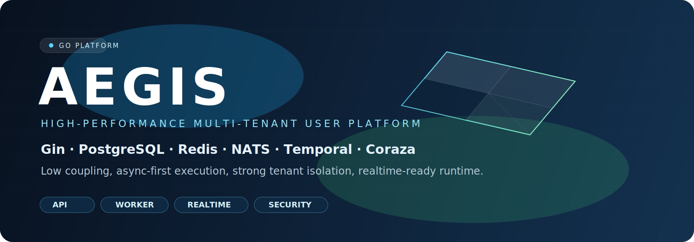
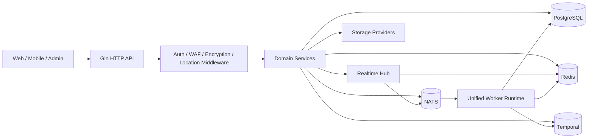

<div align="center">
  
</div>

<div align="center">

**言語:** [English](README.md) | [简体中文](README.zh-CN.md) | **日本語**

[](https://go.dev/)
[](https://gin-gonic.com/)
[](https://www.postgresql.org/)
[](https://redis.io/)
[](https://nats.io/)
[](https://temporal.io/)
[](https://coraza.io/)
[](https://github.com/MiChongs/aegis/actions/workflows/go-ci.yml)
[](https://github.com/MiChongs/aegis/issues)
[](https://github.com/MiChongs/aegis/stargazers)

**Aegis** は、既存の Node.js ベースのマルチアプリケーションユーザーシステムを置き換えるために Go で再構築された、高性能・高並列・低結合・高運用性を重視したプラットフォームです。

</div>

## 概要

| 項目 | 内容 |
| --- | --- |
| 位置付け | 旧 Node.js マルチアプリケーションユーザー基盤の後継バックエンド |
| 実行モデル | 単一の Go エントリーポイントで `API + Worker` を統合 |
| 分離モデル | `appid` を軸にしたテナント境界 |
| 主要データストア | PostgreSQL + Redis |
| イベント基盤 | NATS |
| ワークフロー | Temporal |
| リアルタイム | Gorilla WebSocket + Redis Presence + NATS Fan-out |
| セキュリティ | JWT、通信暗号化、Coraza WAF、階層型管理者権限 |
| 目的 | 同期ボトルネックをキャッシュ優先・非同期優先・水平拡張可能な構成へ置き換えること |

## 目次

- [Aegis を採用する理由](#aegis-を採用する理由)
- [システムビジョン](#システムビジョン)
- [アーキテクチャ](#アーキテクチャ)
- [技術スタック](#技術スタック)
- [主要モジュール](#主要モジュール)
- [リアルタイムとオンライン状態管理](#リアルタイムとオンライン状態管理)
- [セキュリティモデル](#セキュリティモデル)
- [デプロイ](#デプロイ)
- [リポジトリ構成](#リポジトリ構成)
- [API 構成](#api-構成)
- [現在の移行状況](#現在の移行状況)
- [エンジニアリング原則](#エンジニアリング原則)
- [開発](#開発)

## Aegis を採用する理由

旧システムには、局所的な修正では解決できない構造的な問題がありました。

- 同期リクエストチェーンが長すぎる
- サインイン関連クエリがホットパスのボトルネックになった
- Token 検証がデータベース依存だった
- 業務ロジックと基盤実装が強く結合していた
- リアルタイム通信とバックグラウンド処理の水平拡張が難しかった

Aegis はそれらを前提から作り直しています。

- PostgreSQL を主トランザクション DB にする
- Redis にセッション、キャッシュ、未読数、オンライン状態を集約する
- NATS によりプロデューサとコンシューマを疎結合化する
- Temporal でワークフロー自動化を分離する
- Gin で軽量かつ高速な HTTP 実行基盤を構築する
- リアルタイム層を業務サービスから独立させる

## システムビジョン

> 高負荷でも破綻せず、障害時の挙動が予測可能で、境界が明確で、継続的に進化できるバックエンドを構築する。

本プロジェクトは次の5つの原則に基づいています。

1. `appid` は明確なテナント境界でなければならない。
2. ホットパスは、可能な限り重い DB 処理でブロックしない。
3. 業務サービスはインターフェースに依存し、具体的な転送実装には依存しない。
4. バックグラウンド処理とリアルタイム処理は基本的に非同期で扱う。
5. 実行時の挙動は、診断と置換が可能な程度に観測可能であるべき。

## アーキテクチャ



### リクエスト処理戦略

| リクエスト種別 | 戦略 |
| --- | --- |
| 認証 | JWT 解析 + Redis セッション検証 |
| アプリ公開コンテンツ | PostgreSQL + Redis キャッシュ |
| ユーザー概要 | 集約ビューをキャッシュ優先で返す |
| 通知未読数 | Redis 短期 TTL キャッシュ |
| リアルタイム配信 | ローカル Hub + NATS Fan-out |
| オンライン統計 | Redis TTL インデックス |
| ワークフロー自動化 | Temporal |
| 監査系バックグラウンド処理 | NATS -> Worker |

## 技術スタック

| レイヤ | 技術 |
| --- | --- |
| 言語 | Go 1.26 |
| HTTP フレームワーク | Gin |
| データベース | PostgreSQL |
| キャッシュ / セッション / Presence | Redis |
| イベントバス | NATS |
| ワークフローエンジン | Temporal |
| リアルタイム通信 | Gorilla WebSocket |
| WAF | Coraza |
| ロギング | Zap |
| デプロイ | Docker Compose、Windows スクリプト |

## 主要モジュール

### プラットフォーム基盤

- API と Worker の統合ブートストラップ
- マイグレーションベースの PostgreSQL スキーマ管理
- service / repository / transport の明確な分離
- `appid` を中心にしたマルチアプリ分離

### 認証

- パスワード登録とパスワードログイン
- OAuth2 Provider 抽象
- JWT 発行と Redis セッション検証
- マルチデバイスセッションの索引管理と強制失効

### ユーザードメイン

- `my` ビュー集約
- プロフィールと設定管理
- サインイン状態、サインイン実行、履歴取得
- ログイン監査とセッション監査

### 通知センター

- 通知一覧
- 未読数キャッシュ
- 既読、まとめて既読、全件既読
- 削除、クリア
- 通知状態変更時のリアルタイム更新通知

### リアルタイム層

- グローバル WebSocket エンドポイント
- Redis Presence Repository
- オンラインユーザーと接続数の索引
- NATS によるクロスインスタンス配信
- アプリ単位・ユーザー単位のターゲット配信

### 境界防御

- Coraza WAF
- アプリ通信暗号化ミドルウェア
- 標準化されたエラーレスポンス
- 内部情報を露出しないブロック画面とエラー画面

### ワークフローと運用

- Temporal 実行基盤
- Worker ベースのイベント消費
- 非同期ロケーション更新
- Windows ワンクリックデプロイ

## リアルタイムとオンライン状態管理

リアルタイム層は通知サービスやユーザーサービスから独立したサブシステムとして設計されています。

### 設計

| 関心事 | 実装 |
| --- | --- |
| ローカル接続ライフサイクル | プロセス内 realtime hub |
| クロスインスタンス配信 | NATS subject |
| Presence 状態 | Redis TTL インデックス |
| テナント分離 | `appid + userId` |
| 業務側との接続 | インターフェース経由の realtime publisher |

### 現在のエンドポイント

```text
GET /api/ws
GET /api/admin/system/online/stats
GET /api/admin/system/online/apps/:appid
GET /api/admin/system/online/apps/:appid/users
```

### 配信モデル

- ターゲットイベントは `appid` と `userId` ごとに subject を構築
- ローカル接続はアプリ単位・ユーザー単位で管理
- ノード間配信はリアルタイム扇出専用であり、業務永続化は担わない
- 通知変更時は重量オブジェクトではなく軽量な更新イベントを送る

## セキュリティモデル

### 防御レイヤ

| レイヤ | 目的 |
| --- | --- |
| JWT + Redis セッション | 高速な検証と強制ログアウト |
| Coraza WAF | 入口リクエストのフィルタリング |
| アプリ通信暗号化 | テナント単位の通信保護 |
| 管理者階層 | スーパー管理者とスコープ管理者の分離 |
| レスポンスのサニタイズ | 内部情報漏えい防止 |

### 原則

- Token 検証経路に MySQL を使わない
- パブリックなエラー応答に機微情報を出さない
- 業務ロジックを socket 詳細に結合させない
- ホットパスで不要な同期副作用を作らない

## デプロイ

### ローカルクイックスタート

```bash
cp .env.example .env
docker compose -f deploy/docker/docker-compose.yml up -d
go run ./cmd/server migrate
go run ./cmd/server
```

### Windows ワンクリックデプロイ

```powershell
.\deploy\windows\one-click-deploy.cmd
```

### Windows スクリプトで行う内容

- 環境ファイルの準備
- PostgreSQL、Redis、NATS、Temporal の起動
- Go サービスのビルド
- PostgreSQL マイグレーションの実行
- 統合ランタイムの起動

### よく使うコマンド

```powershell
.\deploy\windows\start-stack.cmd
.\deploy\windows\stop-stack.cmd
.\deploy\windows\status.cmd
```

## リポジトリ構成

```text
cmd/
  api/                API 単体起動
  server/             API + Worker 統合起動
  worker/             Worker 単体起動
internal/
  bootstrap/          依存関係組み立てと起動処理
  config/             環境設定読み込み
  db/                 postgres / redis / nats / temporal クライアント
  domain/             ドメイン型と契約
  event/              event subject と publisher
  middleware/         auth、waf、encryption、location、request id
  repository/         postgres、redis、legacy adapter
  service/            業務オーケストレーション
  transport/http/     gin handler と router
deploy/
  docker/             docker 実行ファイル群
  windows/            ワンクリックデプロイスクリプト
migrations/postgres/  schema migration
pkg/
  errors/             typed application errors
  logger/             structured logger bootstrap
  response/           response envelope
  tracing/            tracing integration
sql/
  queries/            sqlc 向け query 定義
```

## API 構成

### 認証

```text
POST /api/auth/register/password
POST /api/auth/login/password
POST /api/auth/oauth2/auth-url
GET  /api/auth/oauth2/callback
POST /api/auth/oauth2/mobile-login
POST /api/auth/refresh
POST /api/auth/logout
POST /api/auth/password/verify
POST /api/auth/password/change
```

### ユーザー

```text
GET    /api/user/banner
GET    /api/user/notice
POST   /api/user/my
GET    /api/user/profile
PUT    /api/user/profile
GET    /api/user/settings
PUT    /api/user/settings
GET    /api/user/security
GET    /api/user/sessions
DELETE /api/user/sessions/:tokenHash
POST   /api/user/sessions/revoke-all
GET    /api/user/signin/status
GET    /api/user/signin/history
POST   /api/user/signin
```

### 通知

```text
GET    /api/notifications
GET    /api/notifications/unread-count
POST   /api/notifications/read
POST   /api/notifications/read-batch
POST   /api/notifications/read-all
DELETE /api/notifications/:notificationId
POST   /api/notifications/clear
```

### 管理 API

```text
GET  /api/admin/apps
GET  /api/admin/apps/:appid
GET  /api/admin/apps/:appid/stats
GET  /api/admin/apps/:appid/users
POST /api/admin/apps/:appid/notifications/bulk
GET  /api/admin/system/roles
GET  /api/admin/system/admins
POST /api/admin/system/admins
PUT  /api/admin/system/admins/:adminId/status
PUT  /api/admin/system/admins/:adminId/access
```

## 現在の移行状況

### すでに再設計・移行済み

- 認証の中核フロー
- アプリ公開設定の取得
- バナーと告知
- ユーザー概要、プロフィール、設定
- サインイン状態と履歴
- ポイント概要とランキング
- 通知センター
- グローバル WebSocket とオンラインユーザー管理
- WAF とアプリ暗号化ミドルウェア
- ストレージ管理基盤
- Temporal ワークフロー基盤

### 移行方針

このリポジトリは旧 Node プロジェクトの逐語的な移植ではありません。
目的はレガシー構造の温存ではなく、アーキテクチャ全体の置換です。

## エンジニアリング原則

- 利便性より低結合を優先する
- ホットパスでは同期処理より非同期処理を優先する
- 正当性が許す範囲でキャッシュを優先する
- テナント境界を明示する
- インターフェース中心で統合する
- 水平拡張可能なリアルタイム設計を維持する
- 運用時に観測できる構造を保つ

## 開発

### ローカル検証

```bash
go mod tidy
go test ./...
```

### 推奨フロー

```bash
git checkout -b feature/your-topic
go test ./...
git commit -m "feat: your change"
```

### CI

GitHub Actions では現在以下を実行します。

- 依存関係解決
- `go test ./...`

ワークフローファイル:

- [`.github/workflows/go-ci.yml`](.github/workflows/go-ci.yml)

## 注意事項

- `.env` は明示的にバージョン管理対象外です
- 本番用シークレットは環境変数またはシークレット管理に置いてください
- 外部公開してコントリビューションを受ける場合は、先に明示的なライセンスを追加してください

## ライセンス

デフォルトではオープンソースライセンスを同梱していません。
