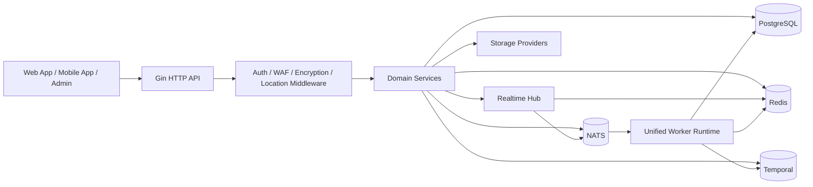

<div align="center">
  
</div>

<div align="center">

[](https://go.dev/)
[](https://gin-gonic.com/)
[](https://www.postgresql.org/)
[](https://redis.io/)
[](https://nats.io/)
[](https://temporal.io/)
[](https://coraza.io/)
[](https://github.com/MiChongs/aegis/actions/workflows/go-ci.yml)
[](https://github.com/MiChongs/aegis/issues)
[](https://github.com/MiChongs/aegis/stargazers)

**Aegis** is a high-performance, multi-tenant user platform rebuilt in Go for **high concurrency**, **strict isolation**, **low coupling**, and **operational clarity**.

</div>

## At A Glance

| Dimension | Description |
| --- | --- |
| Positioning | Successor backend for a legacy Node.js multi-application user system |
| Runtime Model | Unified Go entrypoint carrying `API + Worker` |
| Isolation Model | Tenant boundary enforced by `appid` |
| Core Datastores | PostgreSQL + Redis |
| Event Backbone | NATS |
| Workflow Engine | Temporal |
| Realtime | Gorilla WebSocket + Redis presence + NATS fan-out |
| Security | JWT, transport encryption, Coraza WAF, layered admin model |
| Goal | Replace synchronous bottlenecks with cache-first, async, horizontally scalable flows |

## Contents

- [Why Aegis](#why-aegis)
- [System Vision](#system-vision)
- [Architecture](#architecture)
- [Technology Stack](#technology-stack)
- [Core Modules](#core-modules)
- [Realtime and Presence](#realtime-and-presence)
- [Security Model](#security-model)
- [Deployment](#deployment)
- [Repository Layout](#repository-layout)
- [API Surface](#api-surface)
- [Current Migration Status](#current-migration-status)
- [Engineering Principles](#engineering-principles)
- [Development](#development)

## Why Aegis

The original system suffered from structural issues that were not going to be solved by incremental patching alone:

- synchronous request chains were too long
- sign-in related queries became hot-path bottlenecks
- token validation paths were previously tied to database access
- business logic and infrastructure concerns were coupled together
- horizontal scaling was difficult for realtime and background tasks

Aegis is the corrective architecture:

- PostgreSQL takes over as the primary transactional datastore
- Redis handles session, cache, unread-count and presence workloads
- NATS removes direct coupling between producers and consumers
- Temporal orchestrates workflow automation cleanly
- Gin provides a lean, fast HTTP runtime
- the realtime path is independent from business services

## System Vision

> Build a backend that is fast under load, predictable in failure, explicit in boundaries, and maintainable as the platform grows.

The project is designed around five invariants:

1. `appid` is a first-class tenant boundary.
2. Hot paths should avoid blocking on heavyweight database work whenever a cache or event path is sufficient.
3. Business services should depend on interfaces, not transport-specific implementations.
4. Background and realtime concerns should be asynchronous by default.
5. Runtime behavior should be transparent enough to diagnose without tearing the system apart.

## Architecture



### Request Strategy

| Request Type | Strategy |
| --- | --- |
| Authentication | JWT parse + Redis session validation |
| App public content | PostgreSQL + Redis cache |
| User overview | cache-first aggregation |
| Notification unread count | Redis short TTL cache |
| Realtime push | local hub + NATS fan-out |
| Online user stats | Redis TTL indexes |
| Workflow automation | Temporal |
| Background audits | NATS -> worker |

## Technology Stack

| Layer | Technology |
| --- | --- |
| Language | Go 1.26 |
| HTTP Framework | Gin |
| Database | PostgreSQL |
| Cache / Session / Presence | Redis |
| Event Bus | NATS |
| Workflow Engine | Temporal |
| Realtime | Gorilla WebSocket |
| WAF | Coraza |
| Logging | Zap |
| Deployment | Docker Compose, Windows scripts |

## Core Modules

### Platform Core

- unified bootstrap for API and worker runtime
- PostgreSQL migration-driven schema management
- explicit service / repository / transport separation
- multi-app isolation model centered on `appid`

### Authentication

- password registration and password login
- OAuth2 entrypoints and provider abstraction
- JWT issuance and Redis-backed session validation
- multi-device session indexing and revocation

### User Domain

- `my` view aggregation
- profile and settings management
- sign-in state, sign-in execution and history export
- login audits and session audits

### Notification Center

- notification list
- unread count caching
- mark-as-read and bulk-read
- clear / delete operations
- async notification state push to realtime clients

### Realtime Layer

- global WebSocket endpoint
- Redis presence repository
- online user and connection indexing
- cross-instance targeted fan-out over NATS
- app-scoped and user-scoped delivery

### Security and Edge Protection

- Coraza WAF middleware
- app transport encryption middleware
- standardized error responses
- non-leaking error pages and blocked-request behavior

### Operations and Workflow

- Temporal workflow runtime
- worker event processing
- async location refresh
- Windows one-click deployment

## Realtime and Presence

The realtime implementation is intentionally decoupled from notification, user and admin business services.

### Design

| Concern | Implementation |
| --- | --- |
| Local connection lifecycle | in-process realtime hub |
| Cross-instance fan-out | NATS subjects |
| Presence state | Redis TTL-backed indexes |
| Tenant scoping | `appid + userId` |
| Business integration | interface-based publisher, not direct socket dependency |

### Current Endpoints

```text
GET /api/ws
GET /api/admin/system/online/stats
GET /api/admin/system/online/apps/:appid
GET /api/admin/system/online/apps/:appid/users
```

### Delivery Model

- targeted event subjects are constructed per `appid` and `userId`
- clients are managed locally per application and per user
- cross-node delivery is fan-out only, not business-persistent messaging
- notification mutation paths emit lightweight realtime refresh events

## Security Model

### Defense Layers

| Layer | Purpose |
| --- | --- |
| JWT + Redis session | fast token validity and forced revocation |
| Coraza WAF | inbound request filtering |
| App transport encryption | tenant-specific secure payload transport |
| Admin layering | super admin and scoped admin access control |
| Sanitized response pages | no sensitive backend leakage |

### Principles

- no MySQL dependency in token validation path
- no business-sensitive detail exposure in public-facing error responses
- no direct business-to-socket coupling
- no mandatory synchronous side effects on hot user requests when async is viable

## Deployment

### Local Quick Start

```bash
cp .env.example .env
docker compose -f deploy/docker/docker-compose.yml up -d
go run ./cmd/server migrate
go run ./cmd/server
```

### Windows One-Click

```powershell
.\deploy\windows\one-click-deploy.cmd
```

### What the Windows deployment does

- prepares environment files
- starts PostgreSQL, Redis, NATS and Temporal
- builds the Go service
- runs PostgreSQL migrations
- launches the unified Go runtime

### Useful Commands

```powershell
.\deploy\windows\start-stack.cmd
.\deploy\windows\stop-stack.cmd
.\deploy\windows\status.cmd
```

## Repository Layout

```text
cmd/
  api/                standalone API entry
  server/             unified API + worker entry
  worker/             standalone worker entry
internal/
  bootstrap/          dependency assembly and runtime boot
  config/             environment-driven config
  db/                 postgres / redis / nats / temporal clients
  domain/             domain contracts and types
  event/              subjects and publisher
  middleware/         auth, waf, encryption, location, request id
  repository/         postgres, redis, legacy adapters
  service/            business orchestration
  transport/http/     gin handlers and router
deploy/
  docker/             docker runtime assets
  windows/            local one-click deployment scripts
migrations/postgres/  schema evolution scripts
pkg/
  errors/             typed application errors
  logger/             structured logger bootstrap
  response/           unified response envelope
  tracing/            tracing integration
sql/
  queries/            sqlc-oriented query definitions
```

## API Surface

### Authentication

```text
POST /api/auth/register/password
POST /api/auth/login/password
POST /api/auth/oauth2/auth-url
GET  /api/auth/oauth2/callback
POST /api/auth/oauth2/mobile-login
POST /api/auth/refresh
POST /api/auth/logout
POST /api/auth/password/verify
POST /api/auth/password/change
```

### User

```text
GET    /api/user/banner
GET    /api/user/notice
POST   /api/user/my
GET    /api/user/profile
PUT    /api/user/profile
GET    /api/user/settings
PUT    /api/user/settings
GET    /api/user/security
GET    /api/user/sessions
DELETE /api/user/sessions/:tokenHash
POST   /api/user/sessions/revoke-all
GET    /api/user/signin/status
GET    /api/user/signin/history
POST   /api/user/signin
```

### Notifications

```text
GET    /api/notifications
GET    /api/notifications/unread-count
POST   /api/notifications/read
POST   /api/notifications/read-batch
POST   /api/notifications/read-all
DELETE /api/notifications/:notificationId
POST   /api/notifications/clear
```

### Admin

```text
GET  /api/admin/apps
GET  /api/admin/apps/:appid
GET  /api/admin/apps/:appid/stats
GET  /api/admin/apps/:appid/users
POST /api/admin/apps/:appid/notifications/bulk
GET  /api/admin/system/roles
GET  /api/admin/system/admins
POST /api/admin/system/admins
PUT  /api/admin/system/admins/:adminId/status
PUT  /api/admin/system/admins/:adminId/access
```

## Current Migration Status

### Already Re-Architected

- core authentication flow
- app public configuration
- banner and notice content
- user overview, profile and settings
- sign-in status and sign-in history
- points overview and ranking logic
- notification center
- global WebSocket and online user management
- firewall and app encryption middleware
- storage manager foundation
- Temporal workflow foundation

### Migration Character

This repository is an active migration target, not a line-by-line rewrite of the Node project.
The goal is architectural replacement, not legacy preservation for its own sake.

## Engineering Principles

- low coupling over convenience coupling
- asynchronous execution over hot-path blocking
- cache-first where correctness permits
- explicit tenant boundaries
- interface-first integration points
- horizontally scalable realtime behavior
- operational observability over hidden magic

## Development

### Local Validation

```bash
go mod tidy
go test ./...
```

### Recommended Flow

```bash
git checkout -b feature/your-topic
go test ./...
git commit -m "feat: your change"
```

### CI

GitHub Actions currently runs:

- dependency resolution
- `go test ./...`

Workflow file:

- [`.github/workflows/go-ci.yml`](.github/workflows/go-ci.yml)

## Notes

- `.env` is intentionally excluded from version control
- production secrets must stay in environment variables or secret stores
- if this repository will accept public contribution, add an explicit license first

## License

No open-source license is included by default.
