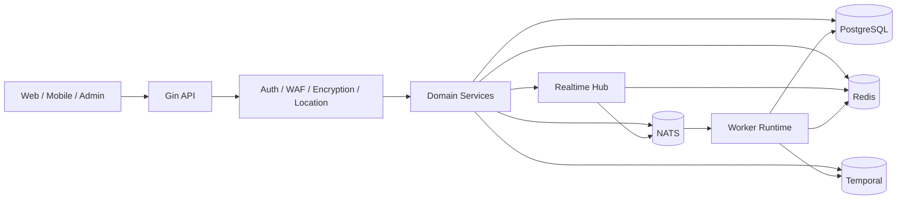

<div align="center">
  
</div>

<div align="center">

**Language:** **English** | [简体中文](README.zh-CN.md) | [日本語](README.ja.md)

[](https://go.dev/)
[](https://gin-gonic.com/)
[](https://www.postgresql.org/)
[](https://redis.io/)
[](https://nats.io/)
[](https://temporal.io/)
[](https://coraza.io/)
[](https://github.com/MiChongs/aegis/actions/workflows/go-ci.yml)

**Aegis** is a production-oriented, multi-tenant user platform built with Go for high concurrency, strong tenant isolation, and low-coupling service design.

</div>

## Overview

Aegis provides a modern backend foundation for user systems that need:

- multi-application isolation based on `appid`
- fast HTTP APIs with a clear service boundary
- cache-first session and presence management
- event-driven background processing
- realtime delivery for user-facing events
- modern workflow orchestration and edge security

## Highlights

- Unified runtime for `API + Worker`
- Multi-tenant application model
- JWT + Redis session architecture
- Realtime hub with Redis presence and NATS fan-out
- PostgreSQL as the primary transactional store
- Temporal workflow integration
- Coraza WAF and app-level transport encryption
- Windows one-click deployment and Docker-based local startup

## Architecture



## Tech Stack

| Layer | Technology |
| --- | --- |
| Language | Go 1.26 |
| HTTP | Gin |
| Database | PostgreSQL |
| Cache / Session / Presence | Redis |
| Messaging | NATS |
| Workflow | Temporal |
| Realtime | Gorilla WebSocket |
| Security | JWT, Coraza WAF, transport encryption |
| Logging | Zap |
| Deployment | Docker Compose, Windows scripts |

## Core Modules

### Identity and Access

- password-based authentication
- OAuth2 provider integration
- JWT issuance and validation
- session indexing and revocation
- layered administrator model

### User Platform

- profile and settings management
- sign-in status and history
- notification center
- session auditing
- points and ranking services

### Realtime

- global WebSocket endpoint
- user-targeted event delivery
- Redis-backed online presence
- NATS-based cross-instance fan-out
- admin online statistics endpoints

### Security

- Coraza WAF middleware
- application transport encryption
- sanitized public error responses
- cache-aware token validation path

### Runtime

- unified server bootstrap
- worker event processing
- Temporal workflow runtime
- storage manager foundation
- async location service path

## Realtime Model

The realtime layer is intentionally kept independent from business services.

| Concern | Implementation |
| --- | --- |
| Connection lifecycle | in-process hub |
| Presence | Redis TTL indexes |
| Cross-node delivery | NATS subjects |
| Tenant scope | `appid + userId` |
| Business integration | interface-based publisher |

### Realtime Endpoints

```text
GET /api/ws
GET /api/admin/system/online/stats
GET /api/admin/system/online/apps/:appid
GET /api/admin/system/online/apps/:appid/users
```

## Quick Start

### 1. Prepare configuration

```bash
cp .env.example .env
```

### 2. Start dependencies

```bash
docker compose -f deploy/docker/docker-compose.yml up -d
```

### 3. Run migrations

```bash
go run ./cmd/server migrate
```

### 4. Start the unified runtime

```bash
go run ./cmd/server
```

## Windows Deployment

```powershell
.\deploy\windows\one-click-deploy.cmd
```

Useful commands:

```powershell
.\deploy\windows\start-stack.cmd
.\deploy\windows\stop-stack.cmd
.\deploy\windows\status.cmd
```

## Project Layout

```text
cmd/
  api/                API entry
  server/             unified runtime entry
  worker/             worker entry
internal/
  bootstrap/          application assembly
  config/             configuration loading
  db/                 postgres / redis / nats / temporal clients
  domain/             domain contracts and types
  event/              subjects and publisher
  middleware/         auth, waf, encryption, location
  repository/         postgres, redis, legacy adapters
  service/            business orchestration
  transport/http/     gin handlers and router
deploy/
  docker/             docker runtime assets
  windows/            deployment scripts
migrations/postgres/  schema migrations
pkg/
  errors/             typed application errors
  logger/             logger bootstrap
  response/           response envelope
  tracing/            tracing integration
```

## Development

### Local validation

```bash
go mod tidy
go test ./...
```

### CI

GitHub Actions runs:

- dependency resolution
- `go test ./...`

Workflow file:

- [`.github/workflows/go-ci.yml`](.github/workflows/go-ci.yml)

## Security Notes

- Do not commit `.env` or production secrets.
- Keep sensitive configuration in environment variables or secret stores.
- Public-facing responses should not expose internal runtime details.

## License

No open-source license is included by default.
