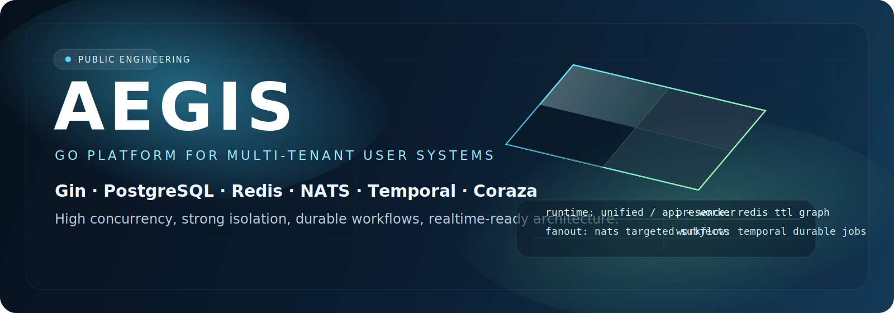
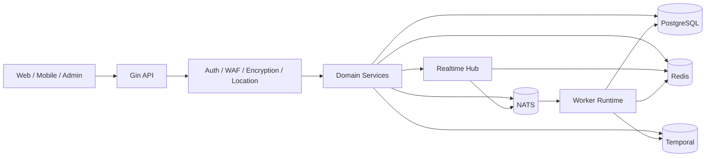

<div align="center">
  
</div>

<div align="center">

**Language:** **English** | [简体中文](README.zh-CN.md) | [日本語](README.ja.md)

[](https://go.dev/)
[](https://gin-gonic.com/)
[](https://www.postgresql.org/)
[](https://redis.io/)
[](https://nats.io/)
[](https://temporal.io/)
[](https://coraza.io/)
[](LICENSE)
[](https://github.com/MiChongs/aegis/actions/workflows/go-ci.yml)

**Aegis** is a production-oriented, multi-tenant user platform built with Go for high concurrency, clean service boundaries, and realtime-ready delivery.

<p>
  <a href="#platform-profile">Platform Profile</a> ·
  <a href="#architecture">Architecture</a> ·
  <a href="#technology-stack">Technology Stack</a> ·
  <a href="#capability-map">Capability Map</a> ·
  <a href="#api-reference">API Reference</a> ·
  <a href="#deployment-modes">Deployment</a> ·
  <a href="#development-workflow">Development</a>
</p>

</div>

## Platform Profile

<table>
  <tr>
    <td width="33%">
      <strong>Runtime Model</strong><br/>
      Unified Go runtime for <code>api + worker</code>, with clear bootstrap boundaries and shared infrastructure clients.
    </td>
    <td width="33%">
      <strong>Tenant Isolation</strong><br/>
      Application boundaries are enforced through <code>appid</code>, with scoped session, cache, notification, and realtime paths.
    </td>
    <td width="33%">
      <strong>Operational Focus</strong><br/>
      Built around predictable hot paths, cache-first validation, async pipelines, and public-safe edge behavior.
    </td>
  </tr>
  <tr>
    <td width="33%">
      <strong>Primary Storage</strong><br/>
      PostgreSQL for transactional data, Redis for session, cache, unread-count, and presence indexing.
    </td>
    <td width="33%">
      <strong>Async Backbone</strong><br/>
      NATS handles event fan-out and decoupled processing; Temporal handles workflow orchestration.
    </td>
    <td width="33%">
      <strong>Realtime Layer</strong><br/>
      Gorilla WebSocket hub with Redis presence and NATS-based cross-instance targeted delivery.
    </td>
  </tr>
</table>

## Engineering Snapshot

| Dimension | Description |
| --- | --- |
| Positioning | Multi-tenant backend platform for user systems and application-facing services |
| Runtime | Gin API + Worker runtime under a unified Go entrypoint |
| Isolation | `appid`-scoped services, caches, notifications, and online presence |
| Persistence | PostgreSQL |
| Cache and Presence | Redis |
| Messaging | NATS |
| Workflow | Temporal |
| Edge Security | Coraza WAF, transport encryption, sanitized responses |

## Architecture



### Request Strategy

<table>
  <tr>
    <td width="25%"><strong>Authentication</strong><br/>JWT parse + Redis session validation</td>
    <td width="25%"><strong>Public App Content</strong><br/>PostgreSQL + Redis cache</td>
    <td width="25%"><strong>User View</strong><br/>Cache-aware aggregation</td>
    <td width="25%"><strong>Realtime Push</strong><br/>Local hub + NATS fan-out</td>
  </tr>
  <tr>
    <td width="25%"><strong>Online Presence</strong><br/>Redis TTL indexes</td>
    <td width="25%"><strong>Background Events</strong><br/>NATS → Worker</td>
    <td width="25%"><strong>Workflow Tasks</strong><br/>Temporal execution</td>
    <td width="25%"><strong>Public Errors</strong><br/>Sanitized edge-safe responses</td>
  </tr>
</table>

## Technology Stack

| Layer | Technology |
| --- | --- |
| Language | Go 1.26 |
| HTTP | Gin |
| Database | PostgreSQL |
| Cache / Session / Presence | Redis |
| Messaging | NATS |
| Workflow | Temporal |
| Realtime | Gorilla WebSocket |
| Security | JWT, Coraza WAF, transport encryption |
| Logging | Zap |
| Deployment | Docker Compose, Windows scripts |

## Capability Map

<table>
  <tr>
    <td width="33%">
      <strong>Identity and Access</strong><br/><br/>
      Password authentication<br/>
      OAuth2 provider integration<br/>
      JWT issuance and validation<br/>
      Session indexing and revocation<br/>
      Layered administrator model
    </td>
    <td width="33%">
      <strong>User Platform</strong><br/><br/>
      Profile and settings management<br/>
      Sign-in status and history<br/>
      Notification center<br/>
      Session auditing<br/>
      Points and ranking services
    </td>
    <td width="33%">
      <strong>Realtime and Runtime</strong><br/><br/>
      Global WebSocket gateway<br/>
      Online presence indexing<br/>
      NATS cross-instance fan-out<br/>
      Worker event processing<br/>
      Temporal workflow execution
    </td>
  </tr>
</table>

## Realtime Model

The realtime layer is intentionally designed as an independent subsystem rather than a transport sidecar attached to business services.

| Concern | Implementation |
| --- | --- |
| Connection lifecycle | in-process hub |
| Presence storage | Redis TTL indexes |
| Cross-node fan-out | NATS subjects |
| Tenant scope | `appid + userId` |
| Business integration | interface-based publisher |

### Realtime Endpoints

```text
GET /api/ws
GET /api/admin/system/online/stats
GET /api/admin/system/online/apps/:appid
GET /api/admin/system/online/apps/:appid/users
```

## API Reference

The project now ships with an auto-generated OpenAPI document and a modern built-in reference UI.

| Artifact | Path |
| --- | --- |
| API reference | `GET /docs` |
| OpenAPI JSON | `GET /openapi.json` |
| Static export command | `go run ./cmd/server openapi ./docs/openapi.json` |

### Why this stack

- Uses `kin-openapi` for code-driven OpenAPI generation instead of Swagger-style annotation tooling.
- Uses a built-in offline-ready reference page so deployed environments do not depend on external CDNs.
- Keeps the documentation layer isolated from service logic so route evolution stays low-coupling.

## Deployment Modes

<table>
  <tr>
    <td width="50%">
      <strong>Local Development</strong><br/><br/>
      <code>cp .env.example .env</code><br/>
      <code>docker compose -f deploy/docker/docker-compose.yml up -d</code><br/>
      <code>go run ./cmd/server migrate</code><br/>
      <code>go run ./cmd/server</code>
    </td>
    <td width="50%">
      <strong>Windows One-Click</strong><br/><br/>
      <code>.\deploy\windows\one-click-deploy.cmd</code><br/><br/>
      Support scripts:<br/>
      <code>start-stack.cmd</code><br/>
      <code>stop-stack.cmd</code><br/>
      <code>status.cmd</code>
    </td>
  </tr>
</table>

## Project Layout

```text
cmd/
  api/                API entry
  server/             unified runtime entry
  worker/             worker entry
internal/
  bootstrap/          application assembly
  config/             configuration loading
  db/                 postgres / redis / nats / temporal clients
  domain/             domain contracts and types
  event/              subjects and publisher
  middleware/         auth, waf, encryption, location
  repository/         postgres, redis, legacy adapters
  service/            business orchestration
  transport/http/     gin handlers and router
deploy/
  docker/             docker runtime assets
  windows/            deployment scripts
migrations/postgres/  schema migrations
pkg/
  errors/             typed application errors
  logger/             logger bootstrap
  response/           response envelope
  tracing/            tracing integration
```

<details>
  <summary><strong>Expanded API Surface</strong></summary>

### Authentication

```text
POST /api/auth/register/password
POST /api/auth/login/password
POST /api/auth/oauth2/auth-url
GET  /api/auth/oauth2/callback
POST /api/auth/oauth2/mobile-login
POST /api/auth/refresh
POST /api/auth/logout
POST /api/auth/password/verify
POST /api/auth/password/change
```

### User

```text
GET    /api/user/banner
GET    /api/user/notice
POST   /api/user/my
GET    /api/user/profile
PUT    /api/user/profile
GET    /api/user/settings
PUT    /api/user/settings
GET    /api/user/security
GET    /api/user/sessions
DELETE /api/user/sessions/:tokenHash
POST   /api/user/sessions/revoke-all
GET    /api/user/signin/status
GET    /api/user/signin/history
POST   /api/user/signin
```

### Notifications

```text
GET    /api/notifications
GET    /api/notifications/unread-count
POST   /api/notifications/read
POST   /api/notifications/read-batch
POST   /api/notifications/read-all
DELETE /api/notifications/:notificationId
POST   /api/notifications/clear
```

</details>

## Development Workflow

### Local Validation

```bash
go mod tidy
go test ./...
```

### CI

GitHub Actions runs:

- dependency resolution
- `go test ./...`

Workflow file:

- [`.github/workflows/go-ci.yml`](.github/workflows/go-ci.yml)

## Security Notes

- Do not commit `.env` or production secrets.
- Keep sensitive configuration in environment variables or secret stores.
- Public-facing responses should not expose internal runtime details.

## License

This project is released under a proprietary license.
Commercial use and redistribution are prohibited without prior written permission.
See [LICENSE](LICENSE) for the full text.
