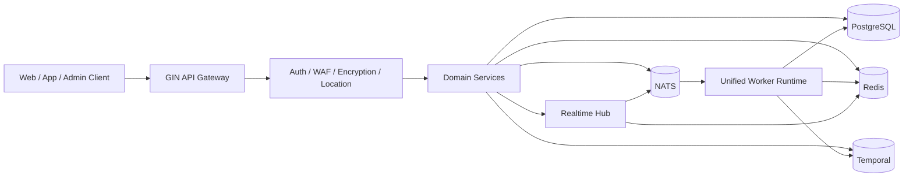

# Aegis

<div align="center">

**A high-performance, multi-tenant user platform built with Go, Gin and PostgreSQL.**

[](https://go.dev/)
[](https://gin-gonic.com/)
[](https://www.postgresql.org/)
[](https://redis.io/)
[](https://nats.io/)
[](https://temporal.io/)
[](https://coraza.io/)
[](https://github.com/MiChongs/aegis/actions)
[](https://github.com/MiChongs/aegis/stargazers)

</div>

## Overview

Aegis is the next-generation Go backend that succeeds a legacy Node.js multi-application user system.
It is designed around low coupling, high concurrency, high observability and horizontally scalable runtime components.

The project focuses on:

- multi-tenant application isolation based on `appid`
- high-performance `Gin + PostgreSQL + Redis + NATS` architecture
- unified API and worker runtime through a single Go entrypoint
- modern security capabilities including JWT session management, transport encryption and WAF
- async workflows, event-driven background processing and real-time communication

## Why Aegis

The legacy system accumulated structural problems around synchronous chains, MySQL-heavy token paths, sign-in hot paths and tightly coupled business services.

Aegis is built to address those problems directly:

- PostgreSQL becomes the primary transactional database
- Redis handles sessions, caches, presence and short-lived indexes
- NATS provides cross-instance event fan-out
- Temporal provides modern workflow orchestration
- Gin provides a lightweight and performant HTTP runtime
- Coraza provides modern WAF protection without exposing internals

## Architecture



## Tech Stack

| Layer | Stack |
| --- | --- |
| Language | Go 1.26 |
| HTTP | Gin |
| Database | PostgreSQL |
| Cache / Session / Presence | Redis |
| Messaging | NATS |
| Workflow Engine | Temporal |
| Realtime | Gorilla WebSocket + NATS + Redis Presence |
| Security | JWT, Coraza WAF, app transport encryption |
| Logging | Zap |
| Deployment | Docker Compose, Windows one-click scripts |

## Core Capabilities

### Platform Foundation

- multi-application isolation with `appid`
- unified server entrypoint carrying both `api + worker`
- PostgreSQL migration-based schema management
- Redis-backed cache, session and online state indexing
- NATS-based event-driven decoupling
- Windows one-click deployment and local Docker startup

### Authentication and Security

- password registration and login
- OAuth2 integration entrypoints
- JWT + Redis session validation
- multi-device session control
- app-level transport encryption middleware
- Coraza WAF integration
- admin hierarchy and permission layering

### User Domain

- `/api/user/my`
- profile and settings management
- sign-in status, history and execution
- security overview
- user session management and forced revoke
- login audit and session audit export

### Notification and Realtime

- notification center with unread cache
- global WebSocket gateway: `GET /api/ws`
- multi-app online user management
- Redis presence repository with TTL indexes
- NATS cross-instance realtime fan-out
- notification state async push to connected clients

### Workflow and Integrations

- Temporal-based workflow runtime
- email service abstraction
- payment module abstraction
- pluggable storage manager
- async location lookup path

## Current Realtime Design

The realtime layer is intentionally independent from business services.

- local connection lifecycle is managed by an in-process hub
- cross-node message delivery is handled by NATS subjects scoped by `appid + userId`
- online presence and connection indexes are stored in Redis
- notification service only depends on a realtime publishing interface, not on WebSocket details

This keeps the project low-coupled and ready for horizontal scaling.

## Project Layout

```text
cmd/
  api/                HTTP entry
  server/             unified runtime entry
  worker/             worker-only entry
internal/
  bootstrap/          application assembly
  config/             configuration loading
  db/                 infrastructure clients
  domain/             domain models
  event/              event subjects and publisher
  middleware/         auth, waf, encryption, location
  repository/         postgres, redis, legacy adapters
  service/            business orchestration
  transport/http/     gin handlers and router
deploy/
  docker/             local compose and Dockerfile
  windows/            one-click deployment scripts
migrations/
  postgres/           schema migrations
pkg/
  errors/             typed application errors
  logger/             zap bootstrap
  response/           standardized HTTP responses
```

## Quick Start

### 1. Prepare environment

```bash
cp .env.example .env
```

### 2. Start dependencies

```bash
docker compose -f deploy/docker/docker-compose.yml up -d
```

### 3. Run migrations

```bash
go run ./cmd/server migrate
```

### 4. Start unified runtime

```bash
go run ./cmd/server
```

## Windows One-Click Deployment

```powershell
.\deploy\windows\one-click-deploy.cmd
```

The script will:

- prepare local environment files
- start PostgreSQL, Redis, NATS and Temporal
- build the Go binary
- run PostgreSQL migrations
- launch a unified runtime for both API and worker

Useful commands:

```powershell
.\deploy\windows\start-stack.cmd
.\deploy\windows\stop-stack.cmd
.\deploy\windows\status.cmd
```

## Admin and Online Management

The current Go implementation includes:

- layered administrator model
- bootstrap super administrator initialization
- system role catalog
- application-level admin access control
- online management endpoints

Available online management endpoints:

```text
GET /api/admin/system/online/stats
GET /api/admin/system/online/apps/:appid
GET /api/admin/system/online/apps/:appid/users
GET /api/ws
```

## Database and Runtime Strategy

### PostgreSQL

PostgreSQL is the primary transactional datastore for:

- users
- apps
- notifications
- points and sign-in aggregates
- workflow definitions
- admin and role data
- storage metadata

### Redis

Redis is used for:

- JWT session storage
- token blacklist
- unread notification caches
- presence and online connection indexes
- short-lived transport and feature caches

### NATS

NATS is used for:

- cross-instance realtime push
- async user events
- decoupled background processing
- worker-driven audit and sign-in pipelines

## Development

### Local checks

```bash
go mod tidy
go test ./...
```

### Recommended workflow

```bash
git checkout -b feature/your-topic
go test ./...
git commit -m "feat: your change"
```

## Migration Status

This repository is an active migration target, not a frozen mirror.

Already migrated or re-architected areas include:

- core authentication flow
- app public info
- banner and notice APIs
- user overview, profile and settings
- sign-in status and sign-in history
- points overview and rankings
- notification center
- global WebSocket and online presence management
- storage manager foundation
- firewall and app encryption middleware
- Temporal workflow foundation

Remaining legacy-compatible modules can continue to be migrated incrementally without changing the core architecture.

## Design Principles

- low coupling over shortcut wiring
- asynchronous execution for hot paths
- cache first, invalidate precisely
- no MySQL dependency in token validation path
- multi-tenant boundaries are explicit
- every blocking chain should be observable and replaceable

## CI

GitHub Actions runs:

- dependency resolution
- `go test ./...`

Workflow file: [`.github/workflows/go-ci.yml`](.github/workflows/go-ci.yml)

## Security Note

Do not commit real `.env` files, production keys or private cloud credentials.

Sensitive configuration should remain in:

- environment variables
- deployment platform secrets
- private runtime configuration stores

## License

This repository currently does not ship an open-source license by default.
If you intend to publish it publicly for reuse, add an explicit license before accepting external contributions.
