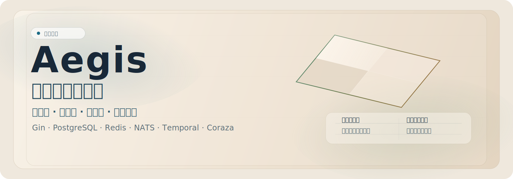
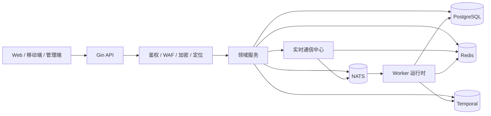

<div align="center">
  
</div>

<div align="center">

**语言：** [English](README.md) | **简体中文** | [日本語](README.ja.md)

[](https://go.dev/)
[](https://gin-gonic.com/)
[](https://www.postgresql.org/)
[](https://redis.io/)
[](https://nats.io/)
[](https://temporal.io/)
[](https://coraza.io/)
[](LICENSE)
[](https://github.com/MiChongs/aegis/actions/workflows/go-ci.yml)

**Aegis** 是一个面向生产环境的多租户用户平台，基于 Go 构建，强调高并发、强隔离、低耦合和实时能力。

<p>
  <a href="#平台概况">平台概况</a> ·
  <a href="#架构">架构</a> ·
  <a href="#技术栈">技术栈</a> ·
  <a href="#能力地图">能力地图</a> ·
  <a href="#api-参考文档">API 参考文档</a> ·
  <a href="#部署方式">部署方式</a> ·
  <a href="#开发流程">开发流程</a>
</p>

</div>

## 平台概况

<table>
  <tr>
    <td width="33%">
      <strong>运行模型</strong><br/>
      单一 Go 运行时统一承载 <code>api + worker</code>，启动边界清晰，基础设施客户端统一复用。
    </td>
    <td width="33%">
      <strong>租户隔离</strong><br/>
      围绕 <code>appid</code> 进行应用边界划分，会话、缓存、通知和实时链路均按应用隔离。
    </td>
    <td width="33%">
      <strong>运维取向</strong><br/>
      以可预测热路径、缓存优先校验、异步处理链路和对外安全响应为核心设计目标。
    </td>
  </tr>
  <tr>
    <td width="33%">
      <strong>主存储</strong><br/>
      PostgreSQL 负责事务数据，Redis 负责会话、缓存、未读数和在线状态索引。
    </td>
    <td width="33%">
      <strong>异步骨干</strong><br/>
      NATS 负责事件扇出与解耦处理，Temporal 负责工作流编排。
    </td>
    <td width="33%">
      <strong>实时层</strong><br/>
      基于 Gorilla WebSocket、Redis Presence 与 NATS 定向分发构建实时系统。
    </td>
  </tr>
</table>

## 工程快照

| 维度 | 说明 |
| --- | --- |
| 项目定位 | 面向用户系统和应用服务场景的多租户后端平台 |
| 运行时 | Gin API + Worker 统一 Go 入口 |
| 隔离方式 | 基于 `appid` 的服务、缓存、通知与在线状态边界 |
| 数据存储 | PostgreSQL |
| 缓存与在线状态 | Redis |
| 消息系统 | NATS |
| 工作流 | Temporal |
| 边界安全 | Coraza WAF、传输加密、净化响应 |

## 架构



### 请求处理策略

<table>
  <tr>
    <td width="25%"><strong>鉴权</strong><br/>JWT 解析 + Redis 会话校验</td>
    <td width="25%"><strong>应用公开内容</strong><br/>PostgreSQL + Redis 缓存</td>
    <td width="25%"><strong>用户聚合视图</strong><br/>缓存感知聚合</td>
    <td width="25%"><strong>实时推送</strong><br/>本地 Hub + NATS 扇出</td>
  </tr>
  <tr>
    <td width="25%"><strong>在线状态</strong><br/>Redis TTL 索引</td>
    <td width="25%"><strong>后台事件</strong><br/>NATS → Worker</td>
    <td width="25%"><strong>工作流任务</strong><br/>Temporal 执行</td>
    <td width="25%"><strong>公共错误响应</strong><br/>对外净化与边界安全</td>
  </tr>
</table>

## 技术栈

| 层 | 技术 |
| --- | --- |
| 语言 | Go 1.26 |
| HTTP | Gin |
| 数据库 | PostgreSQL |
| 缓存 / 会话 / 在线状态 | Redis |
| 消息系统 | NATS |
| 工作流 | Temporal |
| 实时通信 | Gorilla WebSocket |
| 安全 | JWT、Coraza WAF、传输加密 |
| 日志 | Zap |
| 部署 | Docker Compose、Windows 脚本 |

## 能力地图

<table>
  <tr>
    <td width="33%">
      <strong>身份与权限</strong><br/><br/>
      账号密码认证<br/>
      OAuth2 Provider 集成<br/>
      JWT 签发与校验<br/>
      会话索引与撤销<br/>
      分层管理员模型
    </td>
    <td width="33%">
      <strong>用户平台</strong><br/><br/>
      用户资料与设置管理<br/>
      签到状态与历史<br/>
      通知中心<br/>
      会话审计<br/>
      积分与排行服务
    </td>
    <td width="33%">
      <strong>实时与运行时</strong><br/><br/>
      全局 WebSocket 入口<br/>
      在线状态索引<br/>
      NATS 跨实例扇出<br/>
      Worker 事件处理<br/>
      Temporal 工作流执行
    </td>
  </tr>
</table>

## 实时通信模型

实时层被明确设计为独立子系统，而不是挂靠在业务服务上的附属传输层。

| 关注点 | 实现方式 |
| --- | --- |
| 连接生命周期 | 进程内 Hub |
| 在线状态存储 | Redis TTL 索引 |
| 跨节点分发 | NATS Subject |
| 租户范围 | `appid + userId` |
| 业务接入方式 | 基于接口的 Publisher |

### 实时接口

```text
GET /api/ws
GET /api/admin/system/online/stats
GET /api/admin/system/online/apps/:appid
GET /api/admin/system/online/apps/:appid/users
```

## API 参考文档

项目已内置自动生成的 OpenAPI 文档能力，并提供现代化的内置文档界面。

| 产物 | 路径 |
| --- | --- |
| API 文档界面 | `GET /docs` |
| OpenAPI JSON | `GET /openapi.json` |
| 静态导出命令 | `go run ./cmd/server openapi ./docs/openapi.json` |

### 方案说明

- 使用 `kin-openapi` 进行代码驱动的 OpenAPI 生成，不依赖 Swagger 注解体系。
- 使用内置离线文档页，部署环境无需依赖外部 CDN。
- 文档层与业务服务解耦，接口扩展时无需把说明逻辑耦合进控制器实现。

## 部署方式

<table>
  <tr>
    <td width="50%">
      <strong>本地开发</strong><br/><br/>
      <code>cp .env.example .env</code><br/>
      <code>docker compose -f deploy/docker/docker-compose.yml up -d</code><br/>
      <code>go run ./cmd/server migrate</code><br/>
      <code>go run ./cmd/server</code>
    </td>
    <td width="50%">
      <strong>Windows 一键部署</strong><br/><br/>
      <code>.\deploy\windows\one-click-deploy.cmd</code><br/><br/>
      辅助命令：<br/>
      <code>start-stack.cmd</code><br/>
      <code>stop-stack.cmd</code><br/>
      <code>status.cmd</code>
    </td>
  </tr>
</table>

## 目录结构

```text
cmd/
  api/                API 入口
  server/             统一运行时入口
  worker/             Worker 入口
internal/
  bootstrap/          应用装配
  config/             配置加载
  db/                 postgres / redis / nats / temporal 客户端
  domain/             领域契约与类型
  event/              事件主题与发布器
  middleware/         auth, waf, encryption, location
  repository/         postgres, redis, legacy adapters
  service/            业务编排
  transport/http/     gin handlers and router
deploy/
  docker/             docker 运行资源
  windows/            部署脚本
migrations/postgres/  schema migrations
pkg/
  errors/             typed application errors
  logger/             logger bootstrap
  response/           response envelope
  tracing/            tracing integration
```

<details>
  <summary><strong>展开查看 API 面</strong></summary>

### 认证

```text
POST /api/auth/register/password
POST /api/auth/login/password
POST /api/auth/oauth2/auth-url
GET  /api/auth/oauth2/callback
POST /api/auth/oauth2/mobile-login
POST /api/auth/refresh
POST /api/auth/logout
POST /api/auth/password/verify
POST /api/auth/password/change
```

### 用户

```text
GET    /api/user/banner
GET    /api/user/notice
POST   /api/user/my
GET    /api/user/profile
PUT    /api/user/profile
GET    /api/user/settings
PUT    /api/user/settings
GET    /api/user/security
GET    /api/user/sessions
DELETE /api/user/sessions/:tokenHash
POST   /api/user/sessions/revoke-all
GET    /api/user/signin/status
GET    /api/user/signin/history
POST   /api/user/signin
```

### 通知

```text
GET    /api/notifications
GET    /api/notifications/unread-count
POST   /api/notifications/read
POST   /api/notifications/read-batch
POST   /api/notifications/read-all
DELETE /api/notifications/:notificationId
POST   /api/notifications/clear
```

</details>

## 开发流程

### 本地校验

```bash
go mod tidy
go test ./...
```

### CI

GitHub Actions 当前执行：

- 依赖解析
- `go test ./...`

工作流文件：

- [`.github/workflows/go-ci.yml`](.github/workflows/go-ci.yml)

## 安全说明

- 不要提交 `.env` 或生产密钥。
- 敏感配置应保存在环境变量或密钥管理系统中。
- 对外响应不应暴露内部运行时细节。

## 许可证

本项目采用 Apache License 2.0 许可协议。
完整文本见 [LICENSE](LICENSE)。
