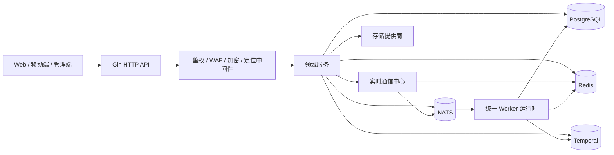

<div align="center">
  
</div>

<div align="center">

**语言：** [English](README.md) | **简体中文** | [日本語](README.ja.md)

[](https://go.dev/)
[](https://gin-gonic.com/)
[](https://www.postgresql.org/)
[](https://redis.io/)
[](https://nats.io/)
[](https://temporal.io/)
[](https://coraza.io/)
[](https://github.com/MiChongs/aegis/actions/workflows/go-ci.yml)
[](https://github.com/MiChongs/aegis/issues)
[](https://github.com/MiChongs/aegis/stargazers)

**Aegis** 是一个以 Go 重构的高性能多租户用户平台，目标是实现 **高并发**、**强隔离**、**低耦合** 与 **可运维性**。

</div>

## 概览

| 维度 | 说明 |
| --- | --- |
| 项目定位 | 面向旧版 Node.js 多应用用户系统的下一代后端 |
| 运行模型 | 统一 Go 入口，内部承载 `API + Worker` |
| 隔离模型 | 以 `appid` 作为租户边界 |
| 核心存储 | PostgreSQL + Redis |
| 事件总线 | NATS |
| 工作流引擎 | Temporal |
| 实时能力 | Gorilla WebSocket + Redis 在线状态 + NATS 跨实例分发 |
| 安全能力 | JWT、传输加密、Coraza WAF、分层管理员体系 |
| 核心目标 | 用缓存优先、异步优先、可横向扩展的架构替代旧同步瓶颈 |

## 目录

- [为什么是 Aegis](#为什么是-aegis)
- [系统目标](#系统目标)
- [架构](#架构)
- [技术栈](#技术栈)
- [核心模块](#核心模块)
- [实时通信与在线状态](#实时通信与在线状态)
- [安全模型](#安全模型)
- [部署](#部署)
- [仓库结构](#仓库结构)
- [API 面](#api-面)
- [当前迁移进度](#当前迁移进度)
- [工程原则](#工程原则)
- [开发](#开发)

## 为什么是 Aegis

原系统存在一些不能只靠局部修补解决的结构性问题：

- 同步链路过长
- 签到相关查询曾成为热点瓶颈
- Token 校验路径曾依赖数据库
- 业务逻辑与基础设施耦合严重
- 实时通信和后台任务缺乏自然的横向扩展路径

Aegis 的目标不是“继续打补丁”，而是从架构层面完成替换：

- PostgreSQL 负责主事务数据
- Redis 负责会话、缓存、未读数和在线索引
- NATS 负责解耦生产者与消费者
- Temporal 负责工作流自动化
- Gin 负责高性能 HTTP 运行时
- 实时层从业务服务中拆出为独立能力

## 系统目标

> 构建一个在高负载下依然稳定、在故障时行为可预测、边界清晰且能持续演进的后端平台。

项目围绕五个基本约束展开：

1. `appid` 必须是明确的一等租户边界。
2. 热路径在可接受前提下优先避免重数据库阻塞。
3. 业务服务依赖接口，不依赖传输层具体实现。
4. 后台任务与实时事件默认走异步链路。
5. 运行时行为必须具备足够可观测性，便于排障与替换。

## 架构



### 请求处理策略

| 请求类型 | 策略 |
| --- | --- |
| 鉴权 | JWT 解析 + Redis 会话校验 |
| 应用公开内容 | PostgreSQL + Redis 缓存 |
| 用户概览 | 聚合视图缓存优先 |
| 通知未读数 | Redis 短 TTL 缓存 |
| 实时推送 | 本地 Hub + NATS 扇出 |
| 在线用户统计 | Redis TTL 索引 |
| 工作流自动化 | Temporal |
| 审计后台任务 | NATS -> Worker |

## 技术栈

| 层 | 技术 |
| --- | --- |
| 语言 | Go 1.26 |
| HTTP 框架 | Gin |
| 数据库 | PostgreSQL |
| 缓存 / 会话 / 在线状态 | Redis |
| 事件总线 | NATS |
| 工作流引擎 | Temporal |
| 实时通信 | Gorilla WebSocket |
| WAF | Coraza |
| 日志 | Zap |
| 部署 | Docker Compose、Windows 脚本 |

## 核心模块

### 平台基础

- API 与 Worker 统一启动装配
- 基于迁移脚本的 PostgreSQL Schema 管理
- 清晰的 service / repository / transport 分层
- 围绕 `appid` 的多应用隔离

### 认证体系

- 账号密码注册与登录
- OAuth2 Provider 抽象
- JWT 签发与 Redis 会话校验
- 多设备会话索引与主动撤销

### 用户域

- `my` 视图聚合
- 资料与设置管理
- 签到状态、执行与历史
- 登录审计与会话审计

### 通知中心

- 通知列表
- 未读数缓存
- 单条已读、批量已读、全部已读
- 清空与删除
- 通知状态变化异步推送到实时客户端

### 实时层

- 全局 WebSocket 入口
- Redis 在线状态仓储
- 在线用户与连接索引
- NATS 跨实例定向扇出
- 应用级、用户级消息投递

### 边界安全

- Coraza WAF 中间件
- 应用传输加密中间件
- 统一错误响应
- 不暴露内部信息的错误页与拦截页

### 工作流与运行时

- Temporal 工作流运行时
- Worker 事件消费
- 异步定位刷新
- Windows 一键部署

## 实时通信与在线状态

实时层被明确设计为独立子系统，不直接绑死在通知、用户或管理业务实现中。

### 设计方式

| 关注点 | 实现方式 |
| --- | --- |
| 本机连接生命周期 | 进程内 realtime hub |
| 跨实例推送 | NATS subject |
| 在线状态 | Redis TTL 索引 |
| 多租户隔离 | `appid + userId` |
| 业务接入方式 | 基于接口的 realtime publisher，而不是直接依赖 socket |

### 当前接口

```text
GET /api/ws
GET /api/admin/system/online/stats
GET /api/admin/system/online/apps/:appid
GET /api/admin/system/online/apps/:appid/users
```

### 投递模型

- 每个目标事件按 `appid` 与 `userId` 构造 subject
- 本机连接按应用和用户分组管理
- 跨节点分发只承担实时扇出，不承担业务持久化
- 通知相关写操作只发轻量刷新事件，不把数据库对象直接耦合给实时层

## 安全模型

### 防护层

| 层 | 目的 |
| --- | --- |
| JWT + Redis 会话 | 快速校验与强制下线 |
| Coraza WAF | 入口请求过滤 |
| 应用传输加密 | 按租户的请求加解密 |
| 管理员分层 | 超级管理员与应用级管理员权限边界 |
| 响应净化 | 避免泄露敏感后端信息 |

### 基本原则

- Token 校验链路不经过 MySQL
- 公共错误响应不暴露业务敏感细节
- 业务逻辑不直接依赖 socket 细节
- 热路径不做不必要的同步副作用

## 部署

### 本地快速启动

```bash
cp .env.example .env
docker compose -f deploy/docker/docker-compose.yml up -d
go run ./cmd/server migrate
go run ./cmd/server
```

### Windows 一键部署

```powershell
.\deploy\windows\one-click-deploy.cmd
```

### Windows 脚本会做什么

- 准备环境文件
- 启动 PostgreSQL、Redis、NATS、Temporal
- 构建 Go 服务
- 执行 PostgreSQL 迁移
- 拉起统一运行时

### 常用命令

```powershell
.\deploy\windows\start-stack.cmd
.\deploy\windows\stop-stack.cmd
.\deploy\windows\status.cmd
```

## 仓库结构

```text
cmd/
  api/                独立 API 入口
  server/             统一 API + Worker 入口
  worker/             独立 Worker 入口
internal/
  bootstrap/          依赖装配与运行时启动
  config/             环境驱动配置
  db/                 postgres / redis / nats / temporal 客户端
  domain/             领域契约与类型
  event/              事件主题与发布器
  middleware/         鉴权、waf、加密、定位、request id
  repository/         postgres、redis、legacy 适配层
  service/            业务编排层
  transport/http/     gin handler 与路由
deploy/
  docker/             docker 运行资源
  windows/            本地一键部署脚本
migrations/postgres/  schema 演进脚本
pkg/
  errors/             类型化应用错误
  logger/             结构化日志启动
  response/           统一响应封装
  tracing/            链路追踪集成
sql/
  queries/            面向 sqlc 的查询定义
```

## API 面

### 认证

```text
POST /api/auth/register/password
POST /api/auth/login/password
POST /api/auth/oauth2/auth-url
GET  /api/auth/oauth2/callback
POST /api/auth/oauth2/mobile-login
POST /api/auth/refresh
POST /api/auth/logout
POST /api/auth/password/verify
POST /api/auth/password/change
```

### 用户

```text
GET    /api/user/banner
GET    /api/user/notice
POST   /api/user/my
GET    /api/user/profile
PUT    /api/user/profile
GET    /api/user/settings
PUT    /api/user/settings
GET    /api/user/security
GET    /api/user/sessions
DELETE /api/user/sessions/:tokenHash
POST   /api/user/sessions/revoke-all
GET    /api/user/signin/status
GET    /api/user/signin/history
POST   /api/user/signin
```

### 通知

```text
GET    /api/notifications
GET    /api/notifications/unread-count
POST   /api/notifications/read
POST   /api/notifications/read-batch
POST   /api/notifications/read-all
DELETE /api/notifications/:notificationId
POST   /api/notifications/clear
```

### 管理端

```text
GET  /api/admin/apps
GET  /api/admin/apps/:appid
GET  /api/admin/apps/:appid/stats
GET  /api/admin/apps/:appid/users
POST /api/admin/apps/:appid/notifications/bulk
GET  /api/admin/system/roles
GET  /api/admin/system/admins
POST /api/admin/system/admins
PUT  /api/admin/system/admins/:adminId/status
PUT  /api/admin/system/admins/:adminId/access
```

## 当前迁移进度

### 已完成重构或迁移

- 核心认证链路
- 应用公开配置读取
- Banner 与公告
- 用户概览、资料与设置
- 签到状态与历史
- 积分概览与排行
- 通知中心
- 全局 WebSocket 与在线用户管理
- 防火墙与应用加密中间件
- 存储管理器基础
- Temporal 工作流基础

### 迁移方式

这个仓库不是对旧 Node 项目的逐行复刻，而是迁移目标与新架构载体。
目标是完成架构替换，而不是保留旧设计包袱。

## 工程原则

- 低耦合优先于方便耦合
- 异步优先于热路径阻塞
- 在正确性允许范围内缓存优先
- 明确租户边界
- 接口优先的集成方式
- 面向横向扩展的实时能力
- 面向运维排障的可观测性

## 开发

### 本地校验

```bash
go mod tidy
go test ./...
```

### 推荐流程

```bash
git checkout -b feature/your-topic
go test ./...
git commit -m "feat: your change"
```

### CI

当前 GitHub Actions 运行：

- 依赖解析
- `go test ./...`

工作流文件：

- [`.github/workflows/go-ci.yml`](.github/workflows/go-ci.yml)

## 说明

- `.env` 被明确排除在版本控制之外
- 生产密钥应保存在环境变量或密钥管理系统中
- 如果后续对外开放协作，建议先补充明确许可证

## 许可证

仓库当前默认未附带开源许可证。
