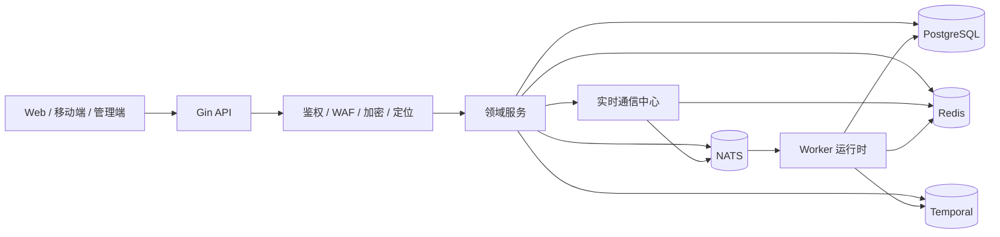

<div align="center">
  
</div>

<div align="center">

**语言：** [English](README.md) | **简体中文** | [日本語](README.ja.md)

[](https://go.dev/)
[](https://gin-gonic.com/)
[](https://www.postgresql.org/)
[](https://redis.io/)
[](https://nats.io/)
[](https://temporal.io/)
[](https://coraza.io/)
[](https://github.com/MiChongs/aegis/actions/workflows/go-ci.yml)

**Aegis** 是一个面向生产环境的多租户用户平台，基于 Go 构建，强调高并发、强隔离和低耦合服务设计。

</div>

## 项目简介

Aegis 提供一套现代化后端基础设施，适用于需要以下能力的用户平台：

- 以 `appid` 为边界的多应用隔离
- 高性能 HTTP API
- 缓存优先的会话与在线状态管理
- 事件驱动的后台处理链路
- 面向用户事件的实时推送
- 现代化工作流编排与边界安全能力

## 核心特性

- `API + Worker` 统一运行时
- 多租户应用模型
- JWT + Redis 会话架构
- Redis 在线状态 + NATS 扇出的实时层
- PostgreSQL 主事务存储
- Temporal 工作流集成
- Coraza WAF 与应用传输加密
- Windows 一键部署与 Docker 本地启动

## 架构



## 技术栈

| 层 | 技术 |
| --- | --- |
| 语言 | Go 1.26 |
| HTTP | Gin |
| 数据库 | PostgreSQL |
| 缓存 / 会话 / 在线状态 | Redis |
| 消息系统 | NATS |
| 工作流 | Temporal |
| 实时通信 | Gorilla WebSocket |
| 安全 | JWT、Coraza WAF、传输加密 |
| 日志 | Zap |
| 部署 | Docker Compose、Windows 脚本 |

## 核心模块

### 身份与权限

- 账号密码认证
- OAuth2 Provider 集成
- JWT 签发与校验
- 会话索引与撤销
- 分层管理员模型

### 用户平台

- 用户资料与设置管理
- 签到状态与签到历史
- 通知中心
- 会话审计
- 积分与排行服务

### 实时系统

- 全局 WebSocket 入口
- 用户定向事件投递
- Redis 在线状态管理
- NATS 跨实例扇出
- 管理端在线统计接口

### 安全体系

- Coraza WAF 中间件
- 应用传输加密
- 对外净化错误响应
- 缓存优先的 Token 校验路径

### 运行时

- 统一服务启动装配
- Worker 事件处理
- Temporal 工作流运行时
- 存储管理器基础
- 异步定位服务链路

## 实时通信模型

实时层被明确设计为独立子系统，不直接耦合业务服务。

| 关注点 | 实现方式 |
| --- | --- |
| 连接生命周期 | 进程内 Hub |
| 在线状态 | Redis TTL 索引 |
| 跨节点分发 | NATS Subject |
| 租户范围 | `appid + userId` |
| 业务接入 | 基于接口的 Publisher |

### 实时接口

```text
GET /api/ws
GET /api/admin/system/online/stats
GET /api/admin/system/online/apps/:appid
GET /api/admin/system/online/apps/:appid/users
```

## 快速开始

### 1. 准备配置

```bash
cp .env.example .env
```

### 2. 启动依赖

```bash
docker compose -f deploy/docker/docker-compose.yml up -d
```

### 3. 执行迁移

```bash
go run ./cmd/server migrate
```

### 4. 启动统一运行时

```bash
go run ./cmd/server
```

## Windows 部署

```powershell
.\deploy\windows\one-click-deploy.cmd
```

常用命令：

```powershell
.\deploy\windows\start-stack.cmd
.\deploy\windows\stop-stack.cmd
.\deploy\windows\status.cmd
```

## 目录结构

```text
cmd/
  api/                API 入口
  server/             统一运行时入口
  worker/             Worker 入口
internal/
  bootstrap/          应用装配
  config/             配置加载
  db/                 postgres / redis / nats / temporal 客户端
  domain/             领域契约与类型
  event/              事件主题与发布器
  middleware/         auth、waf、encryption、location
  repository/         postgres、redis、legacy adapter
  service/            业务编排
  transport/http/     gin handler 与 router
deploy/
  docker/             docker 运行资源
  windows/            部署脚本
migrations/postgres/  数据库迁移
pkg/
  errors/             类型化错误
  logger/             日志启动
  response/           响应封装
  tracing/            链路追踪
```

## 开发

### 本地校验

```bash
go mod tidy
go test ./...
```

### CI

GitHub Actions 当前执行：

- 依赖解析
- `go test ./...`

工作流文件：

- [`.github/workflows/go-ci.yml`](.github/workflows/go-ci.yml)

## 安全说明

- 不要提交 `.env` 或生产密钥。
- 敏感配置应保存在环境变量或密钥管理系统中。
- 对外响应不应暴露内部运行时细节。

## 许可证

仓库当前默认未附带开源许可证。
