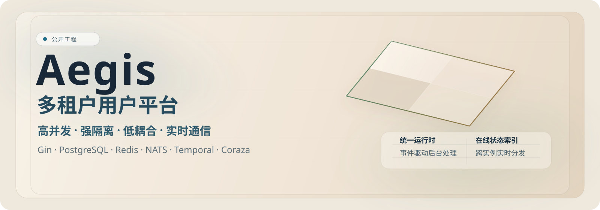
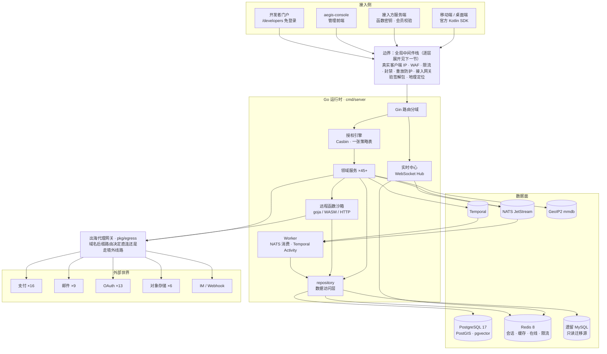
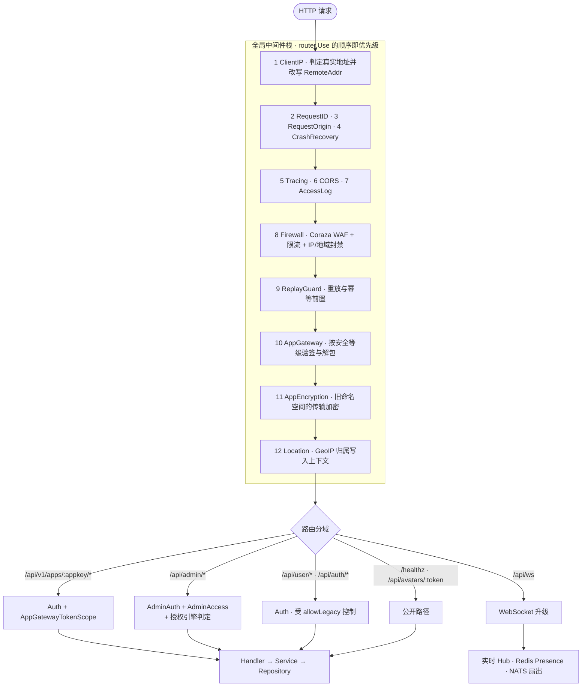
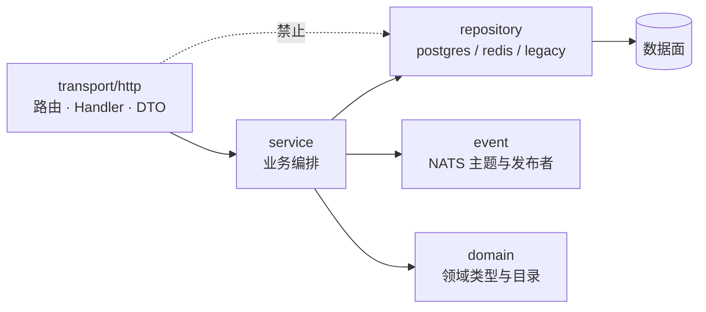

<div align="center">
  
</div>

<div align="center">

**语言：** [English](README.md) | **简体中文** | [日本語](README.ja.md)

[](https://go.dev/)
[](https://gin-gonic.com/)
[](https://www.postgresql.org/)
[](https://redis.io/)
[](https://nats.io/)
[](https://temporal.io/)
[](https://nextjs.org/)
[](https://coraza.io/)
[](LICENSE)
[](https://github.com/MiChongs/aegis/actions/workflows/go-ci.yml)
[](https://github.com/MiChongs/aegis/actions/workflows/console-ci.yml)

**Aegis** 是一套面向生产环境的多租户用户系统平台：一个 Go 运行时承载全部后端能力，
一个 Next.js 控制台承载全部管理界面，接入方只需要认识一个 API 命名空间。

<p>
  <a href="#平台概况">平台概况</a> ·
  <a href="#架构">架构</a> ·
  <a href="#应用接入协议">应用接入协议</a> ·
  <a href="#能力地图">能力地图</a> ·
  <a href="#管理控制台">管理控制台</a> ·
  <a href="#技术栈">技术栈</a> ·
  <a href="#快速开始">快速开始</a> ·
  <a href="#常用命令">常用命令</a> ·
  <a href="#文档与客户端">文档与客户端</a>
</p>

</div>

## 平台概况

Aegis 解决的是同一件事在每个产品里被重写一遍的问题：注册登录、会话与设备、
积分与签到、钱包与会员、支付与凭证、工单与通知、风控与审计。
平台把这些收成一套按 `appid` 隔离的多租户服务，接入方拿到的是**协议与 SDK**，
运营方拿到的是**控制台**，而不是一份需要各自二次开发的脚手架。

<table>
  <tr>
    <td width="33%">
      <strong>一个运行时</strong><br/>
      <code>cmd/server</code> 同进程承载 API 与 Worker；也可拆成 <code>cmd/api</code> +
      <code>cmd/worker</code> 独立伸缩，装配逻辑与依赖注入完全共用。
    </td>
    <td width="33%">
      <strong>一条隔离线</strong><br/>
      以 <code>appid</code> 划分应用边界：用户库、会话、缓存、通知、实时链路、
      配置与密钥全部按应用隔离，跨应用读写在 service 层被显式拦截。
    </td>
    <td width="33%">
      <strong>一个接入面</strong><br/>
      客户端只需要 <code>/api/v1/apps/{appKey}/*</code>：认证、资料、二次认证、
      资产、内容、工单、存储全在其中，接口目录随 <code>/config</code> 机器可读地下发。
    </td>
  </tr>
  <tr>
    <td width="33%">
      <strong>目录驱动</strong><br/>
      支付渠道、邮件服务商、远程函数能力、风控条件、地图供应商都由服务端
      <strong>自述目录</strong>下发，控制台表单与校验共用同一份，前端零硬编码。
    </td>
    <td width="33%">
      <strong>配置必须有执行点</strong><br/>
      任何落库的开关都必须有代码真正读它，且同一件事只允许一个配置入口。
      只存不读的配置比没有更危险 —— 管理员会以为已经防住了。
    </td>
    <td width="33%">
      <strong>可核对的产物</strong><br/>
      OpenAPI、Postman 集合、路由清单、请求模型映射表全部由运行时路由生成，
      并由 CI 检查是否过期，而不是手写维护。
    </td>
  </tr>
</table>

### 工程快照

| 维度 | 现状 |
| --- | --- |
| 后端语言 / 框架 | Go 1.26 · Gin 1.12 · pgx/v5 · Uber Fx 装配 |
| 管理前端 | Next.js 16 · React 19 · Tailwind CSS 4 · shadcn/ui |
| API 规模 | 770+ 条路径 / 920+ 个操作（`docs/openapi.json` 由路由表生成） |
| 领域服务 | `internal/service/` 下 45+ 个服务、240+ 个源文件 |
| 数据库迁移 | `migrations/postgres/` 顺序执行，`000001` → `000082` |
| 控制台页面 | 24 个页面、130+ 个可检索的跳转目标 |
| 内置渠道 | 支付 16 · 邮件 9 · OAuth 13 · 对象存储 6 · 验证码 6 档 · 地图 13 |
| 官方客户端 | `sdk/kotlin`（Android 与 JVM 服务端共用一份产物） |

## 架构

### 系统全景


```mermaid
flowchart TB
    subgraph CL["接入侧"]
        SDK["移动端 / 桌面端<br/>官方 Kotlin SDK"]
        THIRD["接入方服务端<br/>函数密钥 · 会员校验"]
        CONSOLE["aegis-console<br/>管理前端"]
        PORTAL["开发者门户<br/>/developers 免登录"]
    end

    EDGE["边界：全局中间件栈（逐层展开见下一节）<br/>真实客户端 IP · WAF · 限流 · 封禁 · 重放防护 · 接入网关验签解包 · 地理定位"]

    subgraph RT["Go 运行时 · cmd/server"]
        ROUTER["Gin 路由分域"]
        AUTHZ["授权引擎<br/>Casbin · 一张策略表"]
        SVC["领域服务 ×45+"]
        FN["远程函数沙箱<br/>goja / WASM / HTTP"]
        WS["实时中心<br/>WebSocket Hub"]
        WK["Worker<br/>NATS 消费 · Temporal Activity"]
        REPO["repository<br/>数据访问层"]
    end

    subgraph DATA["数据面"]
        PG[("PostgreSQL 17<br/>PostGIS · pgvector")]
        RDS[("Redis 8<br/>会话 · 缓存 · 在线 · 限流")]
        MDB[("遗留 MySQL<br/>只读迁移源")]
        MQ[("NATS JetStream")]
        TP[("Temporal")]
        GEO[("GeoIP2 mmdb")]
    end

    EG["出海代理网关 · pkg/egress<br/>域名后缀路由决定直连还是走境外线路"]

    subgraph OUT["外部世界"]
        PAY["支付 ×16"]
        MAIL["邮件 ×9"]
        OA["OAuth ×13"]
        OSS["对象存储 ×6"]
        IM["IM / Webhook"]
    end

    SDK --> EDGE
    THIRD --> EDGE
    CONSOLE --> EDGE
    PORTAL --> EDGE
    EDGE --> ROUTER

    ROUTER --> AUTHZ --> SVC
    ROUTER --> WS
    SVC --> FN
    SVC --> REPO
    SVC --> MQ
    SVC --> TP
    SVC --> GEO
    FN --> REPO
    WS --> RDS
    WS --> MQ
    MQ --> WK
    TP --> WK
    WK --> REPO
    REPO --> PG
    REPO --> RDS
    REPO --> MDB

    SVC --> EG
    FN --> EG
    EG --> PAY
    EG --> MAIL
    EG --> OA
    EG --> OSS
    EG --> IM
```

**出网只有一个口子。** OAuth、支付、对象存储、GeoIP 更新、Webhook、邮件全部经
`pkg/egress`，由同一张路由表决定每个域名是直连还是走境外线路；网关关闭时全部直连。
详见 [docs/egress-gateway.md](docs/egress-gateway.md)。

### 一个请求要穿过什么


```mermaid
flowchart TB
    REQ(["HTTP 请求"])

    subgraph CHAIN["全局中间件栈 · router.Use 的顺序即优先级"]
        direction TB
        S1["1 ClientIP · 判定真实地址并改写 RemoteAddr"]
        S2["2 RequestID · 3 RequestOrigin · 4 CrashRecovery"]
        S3["5 Tracing · 6 CORS · 7 AccessLog"]
        S4["8 Firewall · Coraza WAF + 限流 + IP/地域封禁"]
        S5["9 ReplayGuard · 重放与幂等前置"]
        S6["10 AppGateway · 按安全等级验签与解包"]
        S7["11 AppEncryption · 旧命名空间的传输加密"]
        S8["12 Location · GeoIP 归属写入上下文"]
        S1 --> S2 --> S3 --> S4 --> S5 --> S6 --> S7 --> S8
    end

    REQ --> S1
    S8 --> R{"路由分域"}
    R -->|"/api/v1/apps/:appkey/*"| A1["Auth + AppGatewayTokenScope"]
    R -->|"/api/admin/*"| A2["AdminAuth + AdminAccess<br/>+ 授权引擎判定"]
    R -->|"/api/user/* · /api/auth/*"| A3["Auth · 受 allowLegacy 控制"]
    R -->|"/api/ws"| A4["WebSocket 升级"]
    R -->|"/healthz · /api/avatars/:token"| A5["公开路径"]

    A1 --> HDL["Handler → Service → Repository"]
    A2 --> HDL
    A3 --> HDL
    A5 --> HDL
    A4 --> HUB["实时 Hub · Redis Presence · NATS 扇出"]
```

`ClientIP` 必须排在第一位：它之后的访问日志、限流、封禁、WAF、地理风控全部建立在
它算出来的地址上，排在它前面的环节取到的会是反代地址。gin 自带的转发头解析被显式
关掉（`SetTrustedProxies(nil)`），避免出现两套判定。详见 [docs/client-ip.md](docs/client-ip.md)。

### 运行形态

| 入口 | 承载 | 适用 |
| --- | --- | --- |
| `cmd/server` | API + Worker 同进程（Unified） | 默认形态，单机与中小规模部署 |
| `cmd/api` | 只跑 HTTP 与 WebSocket | 需要独立伸缩接入层时 |
| `cmd/worker` | 只跑 NATS 消费与 Temporal Worker | 后台任务与工作流独立扩容 |

三个入口共用 `internal/bootstrap` 的同一套装配与生命周期，差别只在启用哪些组件。
`cmd/server` 另外承载全部运维子命令（见[常用命令](#常用命令)）。

### 分层与依赖方向


```mermaid
flowchart LR
    H["transport/http<br/>路由 · Handler · DTO"] --> S["service<br/>业务编排"]
    S --> R["repository<br/>postgres / redis / legacy"]
    R --> D[("数据面")]
    S --> EV["event<br/>NATS 主题与发布者"]
    S --> DM["domain<br/>领域类型与目录"]
    H -. 禁止 .-> R
```

四条硬约束贯穿全仓库：

- **handler 不得直连 repository**，业务判断一律下沉到 service。
- **响应统一走 `pkg/response`**（`response.OK` / `response.Error`），禁止裸 `c.JSON`。
- **配置只能来自 `internal/config.Config`**，业务代码不调用 `os.Getenv`。
- **复杂写操作必须使用 pgx 显式事务**，日志一律 zap 结构化输出。

### 数据面职责划分

| 组件 | 承担 | 不承担 |
| --- | --- | --- |
| PostgreSQL 17 + PostGIS + pgvector | 全部事务数据、审计、地理围栏与分析 | 高频计数与在线状态 |
| Redis 8 | 会话索引、缓存、限流、在线状态、幂等与防重放、排行榜 | 事务真实来源 |
| NATS JetStream | 事件扇出、跨实例实时投递、Worker 解耦 | 长事务编排 |
| Temporal | 工作流编排与重试语义 | 毫秒级请求路径 |
| 遗留 MySQL | 旧 Node.js 系统的只读迁移源 | 任何在线写入 |
| GeoIP2 mmdb | IP 归属与 ASN，自动更新 | 精确定位 |

## 应用接入协议

接入方只需要认识一个命名空间：`/api/v1/apps/{appKey}/*`，覆盖登录之后客户端真正要用的
**全部**能力 —— 认证生命周期、资料与设置、二次认证与 Passkey、会话与审计、
签到 / 积分 / 排行榜、站内信、钱包 / 会员 / 支付、存储上传、工单、轮播图 / 公告 / 版本检查。

### 三档安全等级

三档共用同一批路径与同一份 JSON 结构，只改变请求**怎么包装**；升档只替换一层
transport 适配器，业务代码不动。

| 等级 | 客户端要做的事 | 适用 |
| --- | --- | --- |
| `standard`（默认） | HTTPS + JSON，无密钥、无握手、无密码学库 | 常规业务 |
| `signed` | 额外算一个 HMAC-SHA256 请求签名（v2，**覆盖 query string**） | 防篡改 |
| `sealed` | 在 signed 之上再叠 Transport v2 端到端加密载荷 | 强对抗环境 |

等级累加：`sealed = signed + 加密`。AEAD 只证明密文没被改过（服务端公钥公开，
谁都能造合法密文），签名才证明调用方持有 `appSecret`，两者缺一不可。

三条覆盖全部 HTTP 形状的包装规则：

| 形状 | 怎么包装 |
| --- | --- |
| 有请求体（POST / PUT） | 密文走 body |
| 无请求体（GET / DELETE / HEAD） | 密文走 `?_payload=`，明文是真正的 query string |
| 上传（multipart） | 整个 multipart 体加密，原始类型由 `X-Aegis-Plain-Content-Type` 声明 |

### 四种登录方式

由每个应用的 `loginMethods` / `registerMethods` 控制，两者可选集合刻意不同：

| 方式 | 登录 | 注册 | 入口 |
| --- | :--: | :--: | --- |
| `password` | ✅ | ✅ | `/auth/login`、`/auth/register`（`method` 字段分流） |
| `sms` | ✅ | ✅ | 先 `/auth/sms/code` 取码，再走同两个入口 |
| `oauth` | ✅ | — | `/auth/oauth/url` + `callback`，或原生 `exchange` |
| `cardkey` | ✅ | — | `/auth/login`，卡即凭证，首次使用自动建号并绑卡 |

**卡密没有独立的注册开关**（卡是运营发出去的，发出去就意味着允许它建号），
**第三方没有应用级注册开关**（能否自动建号由每个渠道自己的 `allowRegister` 决定）。
多加一个开关会造出「卡有效但登不进去」这类没人解释得清的状态，或者两处配同一件事。

### 接口目录是单一事实源

接口目录写在 `internal/service/auth_protocol_catalog.go`，随 `/config` 以机器可读形式下发
（`operations` 带方法与鉴权要求，`errors` 带错误码与恢复动作）。目录与真实路由由
`TestGatewayCatalogMatchesRegisteredRoutes` **双向钉死**：目录多一条，生成式客户端会调出 404；
路由多一条，那个能力对生成式客户端就不存在。

包装规格另有四处真实来源，改协议必须同步，否则控制台的「接入自检」会立刻红掉：

| 位置 | 角色 |
| --- | --- |
| `internal/service/auth_protocol_service.go` | 服务端校验 |
| `internal/service/auth_protocol_selftest.go` | 参考客户端实现（自检实跑） |
| `aegis-console/src/lib/integration-snippets.ts` | 给接入方抄的示例 |
| `sdk/kotlin/.../AegisCanonical.kt` | 官方 SDK 里唯一允许拼协议字符串的地方 |

完整规格见 [docs/app-integration.md](docs/app-integration.md)。旧 `/api/auth/*` 明文命名空间
由每个应用的 `allowLegacy` 开关控制，与安全等级正交。

## 能力地图

### 身份与认证

| 能力 | 说明 |
| --- | --- |
| 账号体系 | 密码 / 短信 / 第三方 / 卡密四种登录，注册方式与登录方式分别配置 |
| 会话 | JWT 签发校验 + Redis 会话索引，支持单条撤销与全量下线 |
| 二次认证 | TOTP、恢复码、Passkey（RP ID 跟随访问域名） |
| 密码强度 | zxcvbn 猜测次数估算 + PRECIS RFC 8265 归一化 + 中文语境弱口令补充表 |
| 密码策略 | 复杂度、过期时间、防重用、策略模板，逐项有执行点 |
| 验证码 | 六档：静态图形 / 算术 / 数字 / 音频 / **动态 GIF**（自研 `pkg/gifcaptcha`）/ 手性碳点 |
| 登录一致性 | 设备绑定与换绑冷却、登录 IP 与属地基线、异常拦截 |
| 企业目录 | LDAP / OIDC / SAML 平台级接入 |

### 用户平台

| 能力 | 说明 |
| --- | --- |
| 资料与设置 | 用户资料、用户端设置、管理端设置托管 |
| 头像 | 地址**永久**不失效（编码的是「谁」不是「哪个对象」）+ EXIF 纠正 / 多尺寸 / blurhash / 服务端自绘默认头像 |
| 签到与积分 | 签到状态与历史、自动签到调度、积分与经验、排行榜 |
| 站内信 | 应用用户通知与管理员收件箱两套，角标走 WebSocket 实时推送 |
| 审计 | 登录记录、会话事件、单用户维度审计视图 |
| 组织架构 | 组织 / 部门 / 成员 / 岗位 / 组织角色 / 审批链 / 协作组，Excel 导入导出 |

### 资产与交易

| 能力 | 说明 |
| --- | --- |
| 钱包 | 余额、消费、流水、管理员调账，金额全程 `shopspring/decimal` |
| 会员 | 套餐、余额直购、试用期会员（一人一次由唯一约束保证）、功能标识粒度的服务端校验 |
| 支付 | 16 个内置渠道，全部由 `Provider.Describe()` 自描述：内部钱包 / 支付宝 / 微信支付 / 易支付系聚合六家 / Stripe / PayPal / Paddle / Lemon Squeezy / Square / Razorpay / Coinbase Commerce |
| 凭证 | 订单与钱包流水两类主体都能出 PDF 凭证，同一笔钱只出一份；10 语言 A4 排版（`pkg/receipt`） |
| 卡密 | 授权卡（卡即登录凭证，绑设备、有授权期）与兑换卡（发会员 / 积分 / 经验 / 余额 / 抽奖次数 / 设备位）两种形态 |
| 抽奖 | 奖池与概率配置、发放留痕 |

### 内容与触达

| 能力 | 说明 |
| --- | --- |
| 内容中心 | Banner 投放位（拖拽排序、投放态推导）、应用公告、系统公告，正文写入时 bluemonday 净化 |
| 邮件 | 平台级 + 应用级两种作用域，九档服务商（SMTP / Zeabur / AWS SES / Resend / SendGrid / Mailgun / Postmark / 阿里云 / 腾讯云），一律优先官方 SDK，含八家投递回执验签 |
| 统一通知出口 | 订阅匹配 → 模板渲染 → 多渠道投递 → 留痕重试；渠道含飞书 / 钉钉 / 企业微信 / Slack / Webhook / 邮件 / 站内信 / 实时推送 |
| 工单 | 建单、回复、指派、状态流转、附件、评价、SLA 计时与巡检 |
| 版本发布 | App 版本与更新检查 |

### 开发者能力

| 能力 | 说明 |
| --- | --- |
| 远程函数 | 接入方把自定义 API 逻辑放进服务端 JS 沙箱（goja），另支持 WASM 与自建 HTTP 端点 |
| 试跑 | **读真写假**：读真实数据，写操作只记录不执行，因此额度与会员分支都能测到 |
| 发布门禁 | 发布前静态检查说得出「第几行缺哪项能力」，与发布走同一套判定 |
| 入参契约 | 一份 JSON Schema 同时驱动调用校验、试跑补全与 `ctx.input` 的 TypeScript 类型 |
| 能力目录 | 能力键 / 风险档 / TS 声明 / 内置模板同一份目录驱动服务端校验、SDK 绑定与控制台勾选框 |
| KV | 脚本的服务端独占状态，应用级与用户级两种作用域 |
| 工作流 | Temporal 编排 + 控制台画布编辑器 |
| 存储 | 6 家云存储驱动（Azure Blob / 阿里云 OSS / AWS S3 / 腾讯 COS / 七牛 / WebDAV），桶管理与配额 |

详见 [docs/app-functions.md](docs/app-functions.md)。

### 安全与风控

| 能力 | 说明 |
| --- | --- |
| WAF | Coraza v3 + OWASP CRS v4，拦截日志可查 |
| 风控引擎 | expr-lang 表达式规则（**类型化 Env + 编译缓存**，写错变量名在保存时即报错）、设备与 IP 档案、模拟器与重放 |
| 地理风控 | 不可能旅行 / 新国家 / 远离常驻地，PostGIS 围栏与回测 |
| 封禁 | IP / 地域 / ASN / ISP 封禁，内存匹配 + 热重载 |
| 平台治理 | 六档状态（active / restricted / frozen / suspended / banned / archived）与七项限制，每项都有明确执行点 |
| 授权 | 一份 Casbin 模型、一张 `authz_policies` 表、一个引擎，平台 / 应用 / 组织三种作用域靠域区分 |
| 数据库守护 | 六类泄漏判定（连接 / 事务 / 快照 / WAL / 两阶段事务 / 存储）+ 会话治理 |
| 可观测 | OpenTelemetry 追踪 + Zap 结构化日志 + 崩溃日志落盘 + 监控聚合 |

## 管理控制台

`aegis-console/` 是与后端同仓的 Next.js 16 管理前端，24 个页面覆盖全部运营与配置动作。

| 页面 | 承担 |
| --- | --- |
| `/overview` | 系统总览与实时指标 |
| `/apps`、`/apps/{appKey}` | 应用列表与**应用级配置的唯一归属地**（认证与会话 / 接入 / OAuth / 支付 / 会员 / 卡密 / 存储 …） |
| `/users` | 用户管理与单用户详情（概览 / 资料 / 安全 / 资产 / 活动 / 处置） |
| `/organization` | 组织中心：组织 / 部门 / 成员 / 角色 / 审批 |
| `/content` | 内容中心：Banner / 应用公告 / 系统公告 |
| `/commerce` | 交易中心：订单 / 退款 / 钱包流水 / 会员 / 凭证 |
| `/functions` | 远程函数工作台：一屏 IDE（编辑 → 检查 → 试跑 → 发布 → 回滚） |
| `/workflows` | 工作流画布编辑器 |
| `/storage`、`/releases` | 存储管理与版本发布 |
| `/templates`、`/plugins` | 消息模板与插件系统 |
| `/tickets` | 工单中心与通知出口 |
| `/risk-control`、`/security` | 风控中心（八个页签）与安全运行态 |
| `/platform`、`/platform-banners` | 平台治理台与平台横幅（超管） |
| `/configuration` | **平台级**配置的唯一归属地（防火墙 / 品牌 / 出海网关 / 企业目录 / 自助能力） |
| `/reviews`、`/roles` | 角色申请审批与角色管理 |
| `/audit`、`/reports`、`/device-marketing` | 审计日志、报表分析、设备营销名称字典 |
| `/developers` | 公开开发者门户（免登录）：接入指南 + 可调试的接口文档 |

配置只有两种作用域，各有唯一归属页面 —— 应用级在 `/apps/{appKey}`，平台级在 `/configuration`；
`/platform` 放的不是配置而是**平台对应用的强制结论**，两者是「与」的关系且治理先判。
详见 [docs/platform-governance.md](docs/platform-governance.md)。

## 技术栈

| 层 | 选型 |
| --- | --- |
| 语言 / 框架 | Go 1.26 · Gin 1.12 · Uber Fx |
| 主数据库 | PostgreSQL 17 + PostGIS 3 + pgvector（pgx/v5 连接池） |
| 查询生成 | sqlc 1.31.1（迁移目录即 schema，渐进接管手写 pgx） |
| 缓存 / 会话 | Redis 8（go-redis v9） |
| 消息 | NATS JetStream 2.11 |
| 工作流 | Temporal SDK 1.47 |
| 实时 | Gorilla WebSocket + Redis Presence + NATS 定向分发 |
| 授权 | Casbin v2（一份模型、一张策略表、NATS 跨实例广播） |
| WAF | Coraza v3 + OWASP CRS v4 |
| 脚本沙箱 | goja + goja_nodejs（远程函数 script 运行时） |
| 规则引擎 | expr-lang/expr（类型化 Env + 编译缓存） |
| 地理 | GeoIP2 MaxMind mmdb（自动更新）+ PostGIS |
| 文档 | kin-openapi（代码驱动生成，不依赖 Swagger 注解） |
| 金额 | shopspring/decimal（全程字符串，不转 float） |
| 可观测 | OpenTelemetry + Zap |
| 出网 | 自研 `pkg/egress`：域名后缀路由 + http/https/socks5/socks5h/ssh/trojan/shadowsocks |
| 管理前端 | Next.js 16 · React 19 · Tailwind CSS 4 · shadcn/ui · TanStack Query · Zustand · Monaco |

自研的通用包（`pkg/`）：`banner` 启动横幅、`clientip` 真实客户端 IP、`egress` 出海网关、
`fontkit` 字体归一化、`gifcaptcha` 动态验证码、`i18n` 国际化、`receipt` 支付凭证 PDF、
`routetable` 路由清单渲染、`circuitbreaker` / `resilience` / `taskpool` 韧性与并发。

## 快速开始

### 一键部署（推荐）

```bash
# Linux / macOS：环境检查 → 生成强随机凭据 .env → 构建镜像 → 起全栈 → 自动迁移 → 等待健康
./deploy/docker/quickstart.sh

./deploy/docker/quickstart.sh --infra    # 只起基础设施，业务用 go run 跑在本机
./deploy/docker/quickstart.sh --status   # 查看栈状态
./deploy/docker/quickstart.sh --down     # 停止并移除容器（保留数据卷）
GOPROXY_CN=1 ./deploy/docker/quickstart.sh   # 中国大陆构建加速
```

```powershell
# Windows PowerShell，参数与上面一一对应
.\deploy\docker\quickstart.ps1
.\deploy\docker\quickstart.ps1 -Infra
.\deploy\docker\quickstart.ps1 -Status
.\deploy\docker\quickstart.ps1 -Down
.\deploy\docker\quickstart.ps1 -GoproxyCN

# 另有一组 cmd 包装脚本
.\deploy\windows\one-click-deploy.cmd
.\deploy\windows\start-stack.cmd    # stop-stack.cmd / status.cmd
```

Linux 侧另有 `deploy/linux/` 的 `deploy.sh` / `start.sh` / `stop.sh` / `status.sh`。

### 手动启动

```bash
cp .env.example .env
docker compose -f deploy/docker/docker-compose.yml up -d   # postgres / redis / nats / temporal
go run ./cmd/server migrate                                # 顺序执行迁移
go run ./cmd/server                                        # API + Worker
```

默认监听 `8088`：健康检查 `GET /healthz`，就绪检查 `GET /readyz`，接口文档 `GET /openapi.json`。

### 管理前端

```bash
cd aegis-console
pnpm install
pnpm dev        # 开发服务器，默认 3000，/api 同源反代到后端
pnpm build      # 生产构建 = tsc --noEmit && next build
```

`aegis-console/.env.local` 需要 `NEXT_PUBLIC_API_BASE_URL`；容器构建时后端地址是
**构建期烘死**的（`AEGIS_API_BACKEND`），换地址必须重新构建镜像。
详见 [aegis-console/CLAUDE.md](aegis-console/CLAUDE.md)。

### 必填环境变量

| 变量 | 说明 |
| --- | --- |
| `JWT_SECRET` | JWT 签名密钥 |
| `POSTGRES_DSN` | PostgreSQL 连接串 |
| `REDIS_ADDR` | Redis 地址 |
| `NATS_URL` | NATS 连接地址 |
| `ADMIN_API_TOKEN` | 管理员 API 静态令牌 |
| `ADMIN_BOOTSTRAP_*` | 超级管理员初始账号（账号 / 密码 / 显示名 / 邮箱） |

值得单独确认的可选项（完整清单见 `.env.example`，625 行且逐项带说明）：

| 变量 | 为什么值得确认 |
| --- | --- |
| `TRUSTED_PROXIES` / `CLIENT_IP_*` | 限流、封禁、地理风控、审计全部建立在它算出来的地址上；**判错不报错，只失效**。默认值在 Zeabur / K8s / Docker / 同机反代下开箱即用，站在 Cloudflare 后面时填 `infra,cloudflare` |
| `API_BASE_URL` / `CONSOLE_BASE_URL` | 凭证邮件与通知深链需要绝对地址，留空时链接点不开 |
| `EGRESS_*` | 出海代理网关；关闭时全部直连 |
| `TEMPORAL_*` | 工作流引擎地址与超时 |
| `LEGACY_MYSQL_DSN` | 仅迁移旧系统时需要 |

## 常用命令

### 后端

```bash
go run ./cmd/server                 # Unified：API + Worker
go run ./cmd/api                    # 仅 API
go run ./cmd/worker                 # 仅 Worker

go run ./cmd/server migrate         # 数据库迁移
go run ./cmd/server openapi docs/openapi.json   # 导出 OpenAPI
go run ./cmd/server postman         # 导出 Postman 集合
go run ./cmd/server routes          # 路由清单（不连数据库，生产机器上也能安全跑）
go run ./cmd/server routes --format tree --group 管理端
go run ./cmd/server routes --format json --out docs/routes.json
go run ./cmd/server mock-users      # 生成演示数据

# 旧系统迁移
go run ./cmd/server sync-legacy-user <user_id>
go run ./cmd/server sync-legacy-batch [lastID] [limit]
go run ./cmd/server import-dump <dump.sql> --appid <id> --password <统一密码> [--dry-run]

go test ./...
```

### 代码生成（产物需提交，CI 会检查是否过期）

```bash
sqlc generate                       # 改了 migrations/ 或 sql/queries/ 之后必须跑
sqlc vet && sqlc diff               # CI 跑的就是这两条

go generate ./internal/transport/http/    # 重新生成「路由 → 请求模型」映射表
go run ./scripts/docsgen -check           # CI 跑的就是这条：产物过期即失败
```

### 容器构建

```bash
# 后端（BuildKit cache mount 持有 GOMODCACHE + GOCACHE）
docker build -f deploy/docker/Dockerfile -t aegis-server .
docker build -f deploy/docker/Dockerfile --build-arg WITH_CJK_FONTS=0 -t aegis-server .  # 370MB → 197MB

# 前端（构建上下文是 aegis-console/，后端地址必须是内网地址）
docker build -f deploy/docker/console.Dockerfile \
  --build-arg AEGIS_API_BACKEND=http://aegis-server:8088 \
  -t aegis-console aegis-console
```

Zeabur 部署（一个仓库、两个服务）见 [docs/zeabur-deploy.md](docs/zeabur-deploy.md)。

## 目录结构

```text
cmd/
  api/                    仅 API 入口
  server/                 统一入口 + 全部运维子命令
  worker/                 仅 Worker 入口
internal/
  authz/                  授权引擎：Casbin 模型 + 权限词汇 + 内置角色 + 策略存储
  bootstrap/              应用装配（Uber Fx）、生命周期、CLI 命令、启动横幅
  config/                 配置结构与加载（Viper / .env）
  db/                     postgres / redis / nats / temporal / legacy mysql 客户端
  domain/                 领域类型与自述目录（app / appfunction / payment / vip / …）
  event/                  NATS 事件主题与发布者
  middleware/             客户端 IP / 防火墙 / 接入网关 / 认证 / 加密 / 限流 / 审计
  repository/             数据访问层（含 sqlc 产物 postgres/sqlcgen）
  service/                业务编排：45+ 个领域服务
  transport/http/         Gin 路由分域、Handler、DTO、OpenAPI 生成
pkg/                      通用包：banner / clientip / egress / gifcaptcha / i18n /
                          receipt / routetable / errors / logger / response / tracing …
migrations/postgres/      顺序 SQL 迁移（000001 → 000082）
sql/queries/              sqlc 查询源
scripts/docsgen/          「路由 → 请求模型」映射表生成器
sdk/kotlin/               官方 Kotlin/JVM 客户端
aegis-console/            Next.js 16 管理前端 + 开发者门户
deploy/
  docker/                 Dockerfile / compose / quickstart / 自定义 postgres 镜像
  linux/ · windows/       部署脚本
docs/                     协议、能力与运维文档
```

## 文档与客户端

### API 文档

| 产物 | 位置 |
| --- | --- |
| 接口文档界面 | `/developers/api`（控制台承载，可直接调试） |
| OpenAPI JSON | `GET /openapi.json` |
| 静态导出 | `go run ./cmd/server openapi docs/openapi.json` |
| Postman 集合 | `go run ./cmd/server postman` |
| 路由清单 | `go run ./cmd/server routes`（表格 / 树形 / Markdown / CSV / HTML / JSON） |

后端 `/docs` 与 `/docs/tags/:slug` 已改为 302 跳转到开发者门户（`DOCS_PORTAL_URL`），
Go 侧不再有手写 HTML 文档页。OpenAPI 由 `kin-openapi` 从**运行时路由表**生成，
请求模型由 `scripts/docsgen` 结合 `x/tools` 静态分析推出 —— gin 的 handler 签名擦掉了类型，
没有哪个 OpenAPI 库能代劳。

### 官方客户端

`sdk/kotlin` 是 Kotlin/JVM 纯实现，Android 与 Java 服务端共用一份产物：三档 transport
适配器 + 全量 API，签名与加密的 canonical 字符串与服务端有逐字节互锚的测试。

### 专题文档

| 文档 | 内容 |
| --- | --- |
| [app-integration.md](docs/app-integration.md) | 应用接入协议完整规格（三档安全等级、签名、Transport v2） |
| [app-functions.md](docs/app-functions.md) | 远程函数：能力目录、沙箱、试跑、发布门禁、入参契约 |
| [card-key.md](docs/card-key.md) | 卡密：两种形态、七档权益、一码一用的三道保证 |
| [platform-governance.md](docs/platform-governance.md) | 平台治理：六档状态、七项限制及其执行点 |
| [organization.md](docs/organization.md) | 组织架构：租户边界、内置角色与权限目录 |
| [email.md](docs/email.md) | 邮件：两种作用域、九档服务商、投递回执 |
| [payment-receipt.md](docs/payment-receipt.md) | 支付凭证：两类主体、10 语言排版、字体决策 |
| [avatar.md](docs/avatar.md) | 头像：永久地址的构造与写回闸门 |
| [client-ip.md](docs/client-ip.md) | 真实客户端 IP：受信网段、平台探测、转发链判定 |
| [egress-gateway.md](docs/egress-gateway.md) | 出海代理网关：域名后缀路由与多协议端点 |
| [sqlc.md](docs/sqlc.md) | sqlc 渐进接管方案 |
| [zeabur-deploy.md](docs/zeabur-deploy.md) | Zeabur 上一个仓库两个服务的部署边界 |
| [import-nodejs-dump.md](docs/import-nodejs-dump.md) | 旧 Node.js 系统 mysqldump 直导 |

仓库内另有分层的 `CLAUDE.md`（根目录及各主要模块下），它们是面向代码修改者的上下文索引，
记录每处设计的**理由与硬约束**，改动对应模块前建议先读。

## 测试与 CI

```bash
go test ./...                                                   # 后端
cd aegis-console && pnpm typecheck && pnpm build && pnpm test   # 前端
```

前端全量 `pnpm lint` 目前仍有存量告警，因此 CI 只卡**本次改动的文件**：
新代码进不来带病的，存量按自己的节奏清。

GitHub Actions 当前执行：

| 工作流 | 检查 |
| --- | --- |
| [`go-ci.yml`](.github/workflows/go-ci.yml) | `go test ./...`；`sqlc vet` + `sqlc diff`（生成代码是否与 schema 一致）；`docsgen -check`（请求模型映射表是否过期） |
| [`console-ci.yml`](.github/workflows/console-ci.yml) | `pnpm typecheck`、对**本次改动文件**的 ESLint、`pnpm build` |

若干关键不变量由测试直接钉住，改动时它们会先红：接口目录与真实路由双向一致、
`/api/admin/platform/*` 恒按全局作用域鉴权、组织路由注册顺序不产生前缀树冲突、
路由总表与 golden 快照一致、协议 canonical 字符串与 Kotlin SDK 逐字节相同。

## 安全说明

- 不要提交 `.env` 或任何生产密钥；密钥类字段在管理端一律「留空即不修改」，编辑态从不回显。
- 应用密钥、渠道密钥、SP 私钥等落库前加密，接口只下发 `hasXxx` 布尔位。
- 对外响应统一经 `pkg/response` 净化，不暴露内部运行时细节与堆栈。
- 远程函数沙箱 deny-by-default：没声明的能力在脚本里根本不存在；HTTP 运行时强制 HTTPS、
  禁止重定向，并在实际连接时重新解析 IP 以拒绝内网与云元数据地址。
- 限流、封禁、地理风控与审计全部依赖真实客户端 IP，部署前请按 [docs/client-ip.md](docs/client-ip.md)
  确认 `TRUSTED_PROXIES` —— 这项判错不会报错，只会让上述四样一起静默失效。

## 许可证

本项目采用专有许可证授权。未经书面许可，禁止商用和二次分发。
完整文本见 [LICENSE](LICENSE)。
