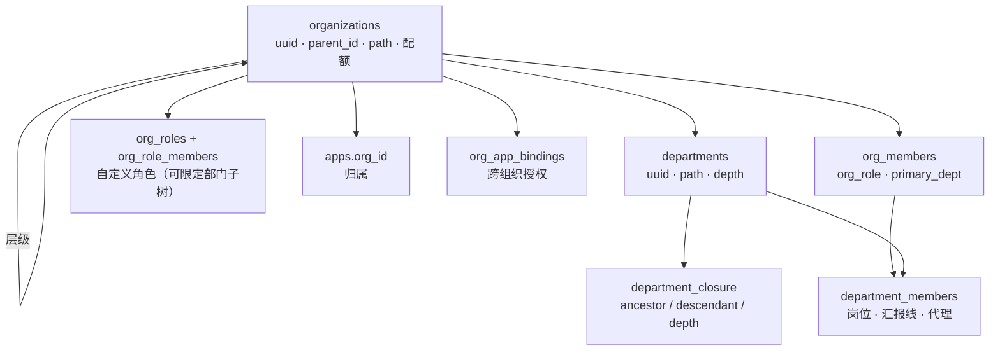

# 组织架构

> 组织是平台的**租户边界**：管理员、应用与资源都归属于某个组织，
> 平台超管与平台管理员跨组织管理，组织内部由自己的角色体系治理。

## 组织 ID

对外一律使用 **UUID**，自增主键不出网。

```jsonc
{
  "id": "9f3a4c1e-7b2d-4e58-9a11-0c6d5f8e2b34",  // organizations.uuid
  "code": "example-tech",                          // 人类可读，可改
  "name": "示例科技"
}
```

| | 用途 | 可变 |
|---|---|:--:|
| `uuid` | 对外唯一标识，API 路径、跨系统引用、日志 | 否 |
| `code` | 人类可读代码，组织内展示与 Excel 导入匹配 | 是 |
| `id`（自增） | 仅库内 JOIN 与物化路径 | 否 |

部门、岗位、组织角色、审批链、权限模板、协作组同样对外只暴露 UUID。
唯一的例外是 `adminId` 与 `appId` —— 它们属于管理员与应用两个既有主键空间。

**所有资源路径都挂在组织之下**：

```
/api/admin/system/organizations/{orgId}/departments/{deptId}
```

组织归属由路径本身携带，服务层据此校验隔离。旧路由把部门挂在顶层
（`/departments/{deptId}`），请求里根本没有组织信息，也就无从校验
「这个部门是不是你家的」。

## 数据模型



### 部门树：物化路径 + 闭包表

两者同时维护，各管一类查询：

| 结构 | 形态 | 擅长 |
|---|---|---|
| 物化路径 | `path = '/1/5/12/'` | 子树范围查询（`LIKE` 前缀）、**环检测**（一次字符串比较） |
| 闭包表 | `(ancestor, descendant, depth)` | 带层数的关系：直接下级、祖先链、第 N 层后代 |

**必须在同一事务里一起改**。任何一边漏更新，树的两个视图就会互相打架。

移动部门时闭包表的重建是两步：

```sql
-- 1. 切断子树与所有旧祖先的连线（子树内部连线保持不动）
DELETE FROM department_closure
 WHERE descendant_id IN (SELECT descendant_id FROM department_closure WHERE ancestor_id = $node)
   AND ancestor_id NOT IN (SELECT descendant_id FROM department_closure WHERE ancestor_id = $node);

-- 2. 新祖先链 × 子树 的笛卡尔积
INSERT INTO department_closure (ancestor_id, descendant_id, depth)
SELECT sup.ancestor_id, sub.descendant_id, sup.depth + sub.depth + 1
  FROM department_closure sup CROSS JOIN department_closure sub
 WHERE sup.descendant_id = $newParent AND sub.ancestor_id = $node;
```

物化路径同步重写：子树内每个节点的新路径 = `新自身路径 || 它相对旧自身路径的后缀`。
对节点自己后缀为空，恰好还原成新路径。

**环检测**：新父节点若落在被移动节点的子树内（`newParent.path` 以 `node.path` 开头），
这次移动会把子树从树上剪下来接到自己身上，形成谁都够不着的环，直接拒绝。

### 删除部门的三种策略

删除非空部门必须由操作者显式选择处置方式，没有默认的「猜一个」：

| 策略 | 行为 |
|---|---|
| `restrict`（默认） | 有子部门或成员时拒绝 |
| `reparent` | 子部门上移一层挂到被删部门的父节点 |
| `cascade` | 连同整棵子树删除，成员退回组织但**保留组织籍** |

> 旧实现靠 `ON DELETE SET NULL`，删一个中层部门会把整棵子树静默甩到根 —— 这是数据事故。
> 现在父子外键是 `RESTRICT`，级联删除时先断开 `parent_id` 引用再整批删
>（同一条 DELETE 里删父子的先后顺序不确定，不断开会随机失败）。

### 组织成员是独立的一层

管理员**先入组织，再决定进哪些部门**。没有这层的话，「已加入公司但还没分配部门」
这种再常见不过的状态无处安放，组织角色也没有落脚点。

数据库层用复合外键锁死归属：

```sql
department_members(department_id, org_id) → departments(id, org_id)   -- 部门必属于该组织
department_members(org_id, admin_id)      → org_members(org_id, admin_id)  -- 成员必是该组织成员
```

跨组织串人在数据库层面即不可能，不依赖服务层记得校验。

## 权限模型

三层叠加，任一层给出权限即放行：

| 层 | 依据 | 典型角色 |
|---|---|---|
| 平台超管 | `is_super_admin` | 无条件放行 |
| 平台管理员 | 全局作用域的 `org:write`（`admin_assignments`） | 跨组织管理 |
| 组织内 | `org_members.org_role` + `org_roles` 自定义角色 | 组织自治 |

### Casbin 组织域

组织权限判定用带 `domain` 的 Casbin 模型：

```
r = sub, dom, obj
p = sub, dom, obj
g = _, _, _
m = g(r.sub, p.sub, r.dom) && (p.dom == "*" || p.dom == r.dom) && (p.obj == "*" || p.obj == r.obj)
```

- 内置角色策略 `p, owner, *, *` —— `dom = "*"` 对所有组织生效
- 自定义角色策略 `p, org:{id}:{roleKey}, org:{id}, {permission}` —— 只在本组织生效

**Casbin 里只装载「角色 → 权限」这一层**（数量 = 角色数 × 权限数，可控）；
「管理员 → 角色」由 `org_members` / `org_role_members` 现查。
把用户关系也灌进内存 enforcer 会随成员数线性膨胀，且每次成员变更都要同步。

角色的增删改会调用 `OrgAccessControl.Reload` 重新装载策略 ——
不重载的话新配的权限要等重启才生效。

### 内置角色

| 角色 | 权限 |
|---|---|
| `owner` 所有者 | `*`（通配）—— 后续新增的权限点自动归它，逐条枚举必然在下次加权限点时漏掉 |
| `admin` 管理员 | 除转让所有权、删除组织外的全部 |
| `manager` 部门主管 | 管人管部门，不碰组织设置与角色授权 |
| `member` 成员 | 只读 + 参与协作 |
| `viewer` 访客 | 只读 |

内置角色**不落库**：它们由代码定义、全组织一致，落库只会带来
「某个组织的 admin 权限被人改小了」这种诡异故障。

### 两条防提权底线

1. **不能操作与自己同级或更高级的成员**（`CanActOnMember`）
   否则两个管理员可以互相降权，所有者会被自己任命的管理员踢掉。
2. **不能授予自己不具备的权限**（`validateRoleInput`）
   否则一个主管可以造一个「拥有 `org:delete`」的角色再授给自己，绕过全部层级约束。

### 部门范围限定

授予组织角色时可以指定 `scope_dept_id`，该角色的权限只在这棵子树内生效
（通过闭包表展开）。被限定的管理员看到的部门树、成员列表都会跟着收敛，
过滤在 SQL 层完成而非查完再筛。

### 前端按钮显隐

`GET /organizations/{orgId}` 的响应带 `access.permissions`，
前端按钮显隐一律读它 —— 与服务端判定同源，不会出现「点了才 403」。
不要在前端按角色推断，那必然与后端漂移。

## 组织状态

| 状态 | 含义 |
|---|---|
| `active` | 正常 |
| `suspended` | 停用，数据保留可恢复 |
| `archived` | **归档只读**，所有写操作被拒绝（`assertWritable`） |

归档的意义就是「冻结现状留作查档」，允许继续写入等于没归档。
归档与恢复归档都是所有者级动作。

## 配额

`member_limit` / `dept_limit` / `app_limit`，0 表示不限。
**只有平台侧能改** —— 否则组织自己把上限调高，配额就形同虚设。

配额在写入前校验；Excel 导入会在**预检阶段**就算清楚，
不会导到一半才发现超了。

## 审批

同一组织 + 同一触发场景**只允许一条启用中的审批链**（唯一索引保证），
否则「哪条生效」取决于查询顺序，配置者无从判断。

审批人类型：

| 类型 | 解析方式 |
|---|---|
| `leader` | 申请人所在部门的负责人（动态解析，无需指定具体的人） |
| `org_role` | 持有指定组织角色的所有成员 |
| `admin` | 指定管理员本人 |
| `position` | 指定岗位的所有持有者 |

**审批人解析写在 SQL 里**，且「待我审批」与「这条该谁审」用同一套规则
（`ListPendingApprovalsFor` / `ResolveStepApprovers`）。两边必须同源，
否则会出现「通知发给了 A，但系统只认 B 的操作」。

推进审批用 `FOR UPDATE` 锁住实例行：两个审批人同时点「通过」时，
不锁会让 `current_step` 各加一次，直接跳过中间步骤。

步骤校验拒绝「`approverType=admin` 但 `approverId=0`」这种配置 ——
旧实现允许它存下来，结果审批发起后永远卡在第一步，谁也看不到。

## 权限模板

模板本身不持有权限。**套用模板 = 生成一个同名组织角色 + 授予选中成员**。

> 旧实现的「应用模板」只是把模板读出来就结束了，没有任何落地动作 ——
> 按钮点了什么都不会发生。

同名角色已存在时复用并更新，重复套用不会每次都堆一个新角色。

## Excel 导入导出

用 `github.com/xuri/excelize/v2`。

导入永远是**两段式**：`dryRun=true` 先把全部问题一次列出来，
而不是导到第 37 行才失败留下半个组织。

模板列：

| 列 | 说明 |
|---|---|
| 部门路径 | `技术中心/平台组`，不存在的层级自动创建 |
| 部门代码 | 新建时使用，已存在的按路径名匹配 |
| 登录账号 | 必填，必须是平台已有的管理员（导入不创建账号） |
| 工号 / 职位 / 组织角色 / 岗位代码 / 是否负责人 / 汇报给 | 选填 |

- 同一人可以出现在多行，表示同时归属多个部门
- **汇报线在第二轮统一处理** —— 第一轮跑完才能保证上级也已经在部门里了
- 导出的文件与导入模板同构，改完可以直接导回去；
  没有部门归属的成员也会导出，否则导出再导入会把他们丢掉

## 真实来源索引

| 位置 | 角色 |
|---|---|
| `internal/domain/organization/` | 领域类型、内置角色与权限目录 |
| `internal/repository/postgres/org_*.go` | 闭包表维护、环检测、组织隔离校验 |
| `internal/service/org_access_control.go` | Casbin 组织域判定 |
| `internal/service/organization_service.go` | 组织 / 部门业务规则 |
| `internal/service/org_member_service.go` | 成员 / 邀请 / 岗位 / 角色 |
| `internal/service/org_approval_service.go` | 审批 / 模板 / 协作组 |
| `internal/service/org_import_export.go` | Excel 导入导出 |
| `migrations/postgres/000066_org_foundation.up.sql` | 表结构与数据回填 |
| `aegis-console/src/components/organization/` | 控制台界面 |

**新增权限点只改 `internal/domain/organization/roles.go`**：
`PermissionCatalog()` 经 `/org-metadata` 下发给控制台，前端权限勾选树零改动。
